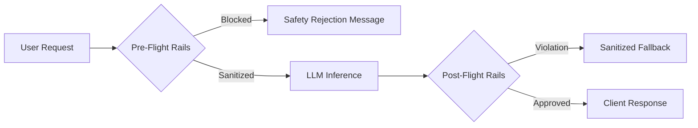

# Module 04: Production Guardrails Architecture

---

## 🗺️ Recommended Step-by-Step Learning Path

Follow this exact sequence to achieve complete mastery of this module:

| Step | File to Open | What You Will Do |
| :---: | :--- | :--- |
| **1** | **[01_README.md](01_README.md)** | Read conceptual overview, architectural foundations, and mental models. |
| **2** | **[00_FOUNDATIONS_PLAYGROUND.md](00_FOUNDATIONS_PLAYGROUND.md)** | Practice beginner spoonfed micro-drills and line-by-line syntax breakdowns. |
| **3** | **[00_try_it_yourself.py](00_try_it_yourself.py)** | Run in terminal (`python 00_try_it_yourself.py`) for an interactive zero-dependency sandbox. |
| **4** | **[04_TROUBLESHOOTING_AND_EDGE_CASES.md](04_TROUBLESHOOTING_AND_EDGE_CASES.md)** | Study forensic runbooks, edge cases, and real-world failure post-mortems. |
| **5** | **[03_SELF_ASSESSMENT_AND_CHALLENGES.md](03_SELF_ASSESSMENT_AND_CHALLENGES.md)** | Test your knowledge with self-assessment quizzes, challenges, and diagnostic scenarios. |
| **6** | **[02_PROJECT_GUIDE.md](02_PROJECT_GUIDE.md)** | Follow guided project implementation for `starter/` and `project_solution/`. |
| **7** | **[problems/](problems/)** | Solve hands-on problem bank challenges and verify with `pytest problems/tests`. |
| **8** | **[debug_lab/](debug_lab/)** | Diagnose and fix silent production bugs in the Bug Hunter Drill. |

---

## 1. Architectural Foundations: Multi-Layered Guardrails

Enterprise LLM safety requires defense-in-depth implemented across three lifecycle phases:
1. **Pre-Flight Input Rails**: Validates input length, blocks adversarial jailbreak prefixes, masks Personally Identifiable Information (PII).
2. **In-Flight Streaming Rails**: Monitors output token stream in real time; aborts generation early if toxic content or system prompt leakage begins.
3. **Post-Flight Output Rails**: Verifies JSON schema compliance, checks hallucination scores, redacts sensitive customer credentials.

---

## 2. PII Detection & Pseudonymization

Under GDPR, HIPAA, and PCI-DSS, storing or transmitting PII to third-party LLM providers constitutes a compliance violation.
- **Pattern Matching (Regex)**: Fast ($O(N)$), deterministic detection of structured entities (SSNs, credit card numbers, IBANs, phone numbers).
- **Named Entity Recognition (NER)**: Machine learning models (e.g. spaCy, Microsoft Presidio) detecting unstructured entities (person names, physical addresses, hospital IDs).
- **Reversible Token Anonymization**: Replacing `"John Doe"` with `"<PERSON_1>"`, sending anonymized text to the LLM, and re-hydrating `"<PERSON_1>"` back to `"John Doe"` on the outbound client stream.
