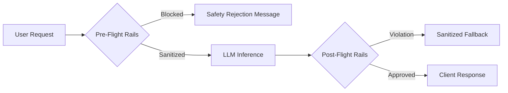

# Module 04: Production Guardrails Architecture

## 1. Architectural Foundations: Multi-Layered Guardrails

Enterprise LLM safety requires defense-in-depth implemented across three lifecycle phases:
1. **Pre-Flight Input Rails**: Validates input length, blocks adversarial jailbreak prefixes, masks Personally Identifiable Information (PII).
2. **In-Flight Streaming Rails**: Monitors output token stream in real time; aborts generation early if toxic content or system prompt leakage begins.
3. **Post-Flight Output Rails**: Verifies JSON schema compliance, checks hallucination scores, redacts sensitive customer credentials.

---

## 2. PII Detection & Pseudonymization

Under GDPR, HIPAA, and PCI-DSS, storing or transmitting PII to third-party LLM providers constitutes a compliance violation.
- **Pattern Matching (Regex)**: Fast ($O(N)$), deterministic detection of structured entities (SSNs, credit card numbers, IBANs, phone numbers).
- **Named Entity Recognition (NER)**: Machine learning models (e.g. spaCy, Microsoft Presidio) detecting unstructured entities (person names, physical addresses, hospital IDs).
- **Reversible Token Anonymization**: Replacing `"John Doe"` with `"<PERSON_1>"`, sending anonymized text to the LLM, and re-hydrating `"<PERSON_1>"` back to `"John Doe"` on the outbound client stream.
