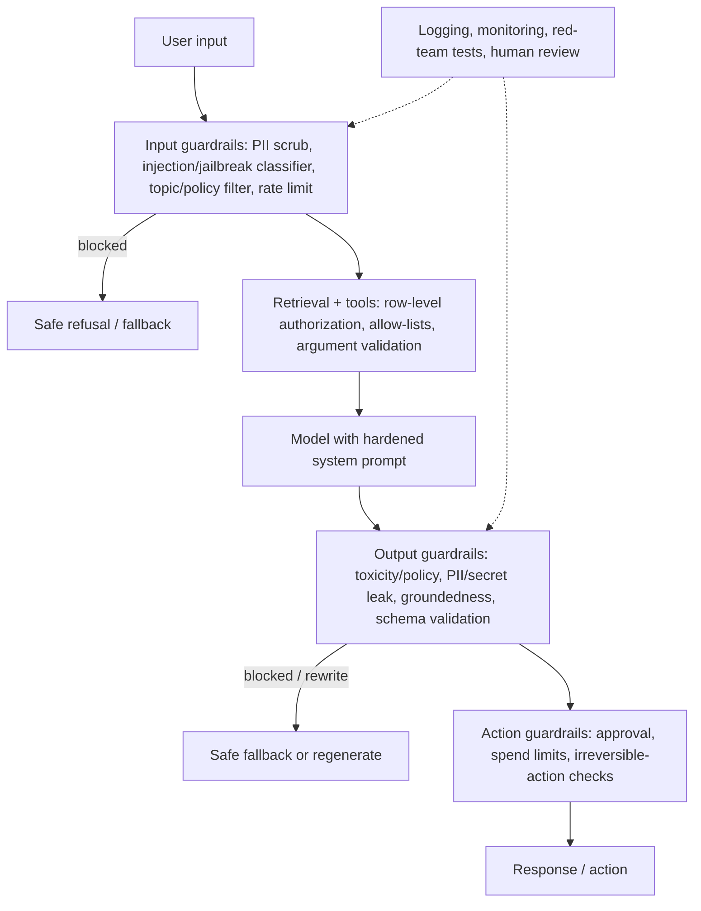

# Module 04: Production Guardrails Architecture & Policy Filters

> **Architectural Scope**: A layered defence architecture around an LLM application (input, retrieval/tool, model, output and action layers), policy filter mechanisms (rules, classifiers, LLM checks), the latency/cost/accuracy trade-offs, base-rate arithmetic, streaming, fail-open vs fail-closed design, and treating policy as testable code.

---

## Why this module matters

An LLM is a general-purpose text generator, and a prompt that says "never reveal confidential data" is a *request*, not a control. In production, models are asked to do things their operators never intended: users probe for leaks, attackers inject instructions through documents, and benign users hit edge cases that produce toxic, false, off-brand or legally risky text. **Guardrails** are the engineered controls around the model that detect and prevent unacceptable inputs, outputs and actions. They are the difference between a demo and a system you can put in front of customers, regulators and auditors.

## Mental model: airport security, not a single locked door

Security at an airport has multiple independent layers: ID check, baggage screening, metal detector, boarding checks, behavioural observation. Each layer catches some things the others miss, none is perfect, and some checks (like the final gate agent) are cheap while others (physical search) are costly and used selectively. Guardrails work the same way: **defence in depth**, with cheap, fast checks applied to everything and expensive checks applied where risk warrants.

```mermaid
flowchart TD
    U["User input"] --> IG["Input guardrails: PII scrub, injection/jailbreak classifier, topic/policy filter, rate limit"]
    IG -->|"blocked"| R1["Safe refusal / fallback"]
    IG --> RT["Retrieval + tools: row-level authorization, allow-lists, argument validation"]
    RT --> LLM["Model with hardened system prompt"]
    LLM --> OG["Output guardrails: toxicity/policy, PII/secret leak, groundedness, schema validation"]
    OG -->|"blocked / rewrite"| R2["Safe fallback or regenerate"]
    OG --> ACT["Action guardrails: approval, spend limits, irreversible-action checks"]
    ACT --> OUT["Response / action"]
    MON["Logging, monitoring, red-team tests, human review"] -.-> IG
    MON -.-> OG
```

## 1. The layers

| Layer | Controls | Examples |
|---|---|---|
| **Input** | validate and screen the request before it reaches the model | PII detection/redaction, prompt-injection and jailbreak detection, off-topic or disallowed-topic filters, language/length limits, rate limiting, authentication |
| **Prompt / model** | reduce the chance of bad behaviour | hardened system prompts (clear rules, delimiters), safety-tuned models, constrained outputs (schemas), low temperature for factual tasks |
| **Retrieval and tools** | limit what the model *can see and do* | **document-level and row-level authorization at retrieval time**, tenant isolation, tool allow-lists and argument validation, least-privilege credentials, sandboxing (course 11, Modules 03 and 06) |
| **Output** | screen what is about to be shown | toxicity/harassment/self-harm/sexual/violence classifiers, PII and secret leakage detection, **groundedness / hallucination check** against sources, brand and legal policy checks (competitor mentions, medical/financial advice disclaimers), schema and format validation |
| **Action** | gate consequential effects | human approval for irreversible/high-value actions, spending and rate caps, dry-run modes (course 11, Module 07) |
| **Monitoring and response** | detect what slipped through | logging, alerts on block-rate and anomaly, sampled human review, incident playbooks, red-team regression suites (Module 07) |

**Key principle: guardrails are not a security boundary against a determined attacker, and the model must never be the enforcement point for authorisation.** Access control, data scoping and action permissions are enforced in **code and infrastructure** (retrieval filters, scoped tokens, sandboxes); guardrails add detection and policy on top.

## 2. Policy filter mechanisms

| Mechanism | How it works | Strengths | Weaknesses |
|---|---|---|---|
| **Rule-based** (regex, keyword and entity lists, allow/deny lists, format checks) | deterministic pattern matching | fastest, cheapest, explainable, auditable; ideal for PII patterns, secrets (API key formats), forbidden strings | brittle; easy to evade with paraphrase or obfuscation; high maintenance |
| **Classifier models** (small fine-tuned models: OpenAI moderation, Llama Guard, ShieldGemma, Azure AI Content Safety, AWS Bedrock Guardrails, Perspective API, Prompt Guard) | score text against policy categories or threats | fast (tens of ms), accurate on trained categories, cheap at scale | fixed taxonomy; threshold tuning needed; can miss novel attacks and context |
| **LLM-as-judge policy check** | prompt a model with your policy and the content, get a verdict + reason | flexible: custom policies in plain language, handles nuance | slower and costlier; can itself be attacked or biased (Module 02) |
| **Embedding / similarity matching** | compare to examples of known-bad or allowed content | cheap, catches paraphrases of known attacks | needs good example sets |
| **Programmatic validators** (schema, SQL/URL allow-lists, code AST checks, groundedness via NLI) | verify structure and facts | precise for what they check | narrow |
| **Dialog/flow rails** (NeMo Guardrails Colang) | steer conversations along allowed flows | controls topics and dialogue behaviour | needs authored flows (Module 05) |

Practical stack: **rules for the unambiguous, classifiers for the broad, an LLM check for the nuanced**, with escalating cost.

## 3. Trade-offs you must engineer

### Latency and cost

Each guardrail adds time. Typical orders of magnitude: regex under 1 ms; small classifier 10 to 100 ms; LLM check 300 ms to a few seconds. Tactics: run independent input checks **in parallel** with each other (and speculatively with retrieval or even the first model tokens, cancelling if a check fails); use small models for the first pass and **cascade** to a large judge only for uncertain cases; **cache** verdicts for repeated content; apply heavy checks only to **high-risk** routes. For **streaming** outputs, moderate in **chunks** (per sentence or every N tokens) and be able to **stop and retract** a stream when a violation appears; stricter products buffer and check before releasing.

### Accuracy: false positives versus false negatives, and the base-rate trap

Every threshold trades **missed violations (false negatives)** against **wrongly blocked good content (false positives, "over-refusal")**.

**Worked example.** 1,000,000 requests/day, 1% genuinely malicious (10,000 bad, 990,000 benign). Classifier at threshold 0.5: recall 92%, false-positive rate 3%. It catches 9,200 bad and misses 800, but also blocks `0.03 x 990,000 = 29,700` benign requests: **three benign users are blocked for every attacker caught**. Raising the threshold to 0.8 (recall 80%, FPR 0.5%) catches 8,000, misses 2,000, and blocks 4,950 benign users. Neither is "right": the choice depends on the cost of each error. For a bank assistant a missed leak is severe; for a casual chatbot over-blocking is. Rare events make even good classifiers noisy in absolute terms, which is why you measure precision and recall **on your traffic mix**, use tiered responses (block, warn, allow-but-log, human review) rather than binary blocking, and invest in appeal and feedback paths.

### Fail-open vs fail-closed

If a guardrail service is down or times out, do you **allow** the request (fail-open: availability) or **block** it (fail-closed: safety)? Choose per route: fail-closed for high-risk actions and regulated content; fail-open (with logging and degraded checks) for low-risk chat. Make the decision explicit and test it.

## 4. Designing the policy

1. **Write the policy first** in plain language: what is disallowed, what is allowed, what requires escalation, with **examples and counter-examples** for each category (this becomes both the classifier/judge prompt and the test set).
2. **Prioritise by risk**: data leakage and unauthorised actions first, then harmful content, hallucination in sensitive domains, brand and tone.
3. **Define responses** per violation: refuse politely with a helpful alternative, redact, regenerate with stricter instructions, route to a human, or end the session. Avoid preachy over-refusals.
4. **Policy as code**: store policies, thresholds and prompts in version control; review changes; test them in CI against a labelled suite (including benign look-alikes that must **not** be blocked and attack examples that must).
5. **Per-tenant and per-locale configuration**: regulations and norms differ.
6. **Explainability and audit**: log which rule or classifier fired, with scores, for every block; keep privacy in mind when logging content.
7. **Continuous improvement**: sample production traffic for review, feed misses and false positives back into the rules, classifiers and test suites (Module 08 observability).

## Worked example: a customer-support assistant with account data

Input: parallel checks (PII redaction of card numbers, prompt-injection classifier, topic filter) in about 40 ms. Retrieval: only documents and account records belonging to the **authenticated customer** are searchable (enforced by query filters, not the prompt). Model: system prompt with explicit rules and a schema for tool calls. Tools: `refund` limited to 100 USD without human approval. Output: PII-leak scan (regex plus classifier), groundedness check that every policy claim is supported by retrieved text (if not, regenerate or answer "I'll connect you with an agent"), and brand filter. Monitoring: dashboards of block rates per rule, weekly sampled review, red-team regression suite in CI. Result: a prompt injection in a customer-uploaded PDF is caught twice (retrieval-layer isolation limits what it can reach; the output scan blocks the attempted leak), demonstrating why layers beat any single check.

## Common pitfalls

1. **Relying on the system prompt as the only control.**
2. **Enforcing authorisation in the prompt** rather than at retrieval/tool level.
3. **One guardrail, no layers**, so a single bypass means total failure.
4. **Tuning thresholds without measuring precision/recall on real traffic**, causing high over-blocking or silent misses.
5. **Ignoring latency**, stacking sequential LLM checks that double response time.
6. **Binary block/allow only**, with no review path, appeals or degraded modes.
7. **No tests for benign look-alikes**, so policy updates break legitimate use.
8. **Unmonitored guardrails**: block rates drift, attackers adapt, nobody notices.
9. **Logging sensitive content** carelessly while auditing.

## How this connects

- **Module 05** implements these layers with NeMo Guardrails and Llama Guard; **Module 06** catalogues the attacks guardrails must withstand (OWASP Top 10 for LLMs); **Module 07** tests them with automated red teaming; **Module 08** monitors them in production.
- **Course 11, Modules 03, 06 and 07** supply tool validation, sandboxing and human approval (the action layer); **Course 10, Module 05** relates to retrieval-time filtering and thresholds; **Course 04** covers rate limiting, authorisation and fail-open/closed design.

## Go further

- roadmap.sh: *AI Engineer* nodes **AI safety and ethics**, **content moderation APIs**, **prompt injection**, **security and privacy concerns**; *AI Red Teaming* roadmap; *DevSecOps*.
- OpenAI Moderation and Azure AI Content Safety documentation; AWS Bedrock Guardrails; Guardrails AI documentation; Inan et al., *Llama Guard* (2023); NIST AI Risk Management Framework; OWASP Top 10 for LLM Applications.

---

## Module Study Progression
1. **Beginner Playground**: Read [00_FOUNDATIONS_PLAYGROUND.md](00_FOUNDATIONS_PLAYGROUND.md).
2. **Architecture Theory**: Study this [01_README.md](01_README.md).
3. **Hands-on Project**: Follow [02_PROJECT_GUIDE.md](02_PROJECT_GUIDE.md).
4. **Staff Interview Challenges**: Check [03_SELF_ASSESSMENT_AND_CHALLENGES.md](03_SELF_ASSESSMENT_AND_CHALLENGES.md).
5. **Production Debugging**: Review [04_TROUBLESHOOTING_AND_EDGE_CASES.md](04_TROUBLESHOOTING_AND_EDGE_CASES.md).
