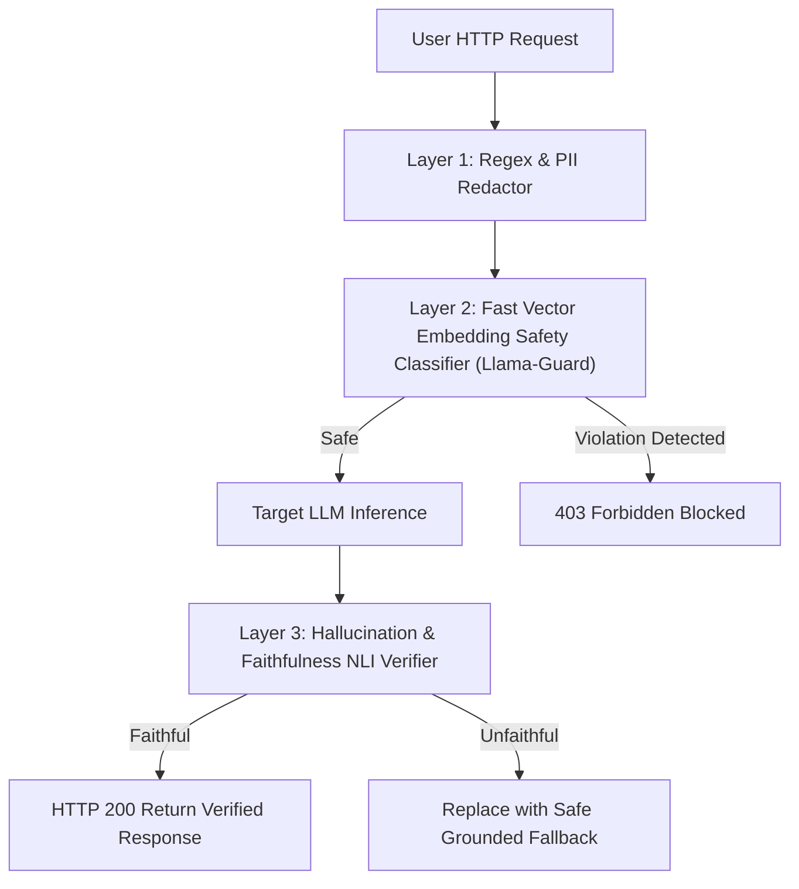

# Module 05: NeMo Guardrails and Llama Guard


## Production Real-Time Guardrail Defense Layers



---

## 1. Architectural Foundations: Programmable Safety State Machines

### 1.1 NVIDIA NeMo Guardrails & Colang

NVIDIA NeMo Guardrails introduces **Colang**, a modeling language that controls LLM dialog flow through explicit state transitions:
1. **Canonical Forms**: Maps diverse natural language user inputs to canonical user intents:
   ```colang
   define user ask about politics
     "Who will win the presidential election?"
     "What do you think about the senator?"
   ```
2. **Dialog Flows**: Specifies exact bot response policies:
   ```colang
   define flow politics
     user ask about politics
     bot refuse political discussion
   ```
3. **Execution Semantics**: The Colang engine intercepts inputs before the LLM generates text. If a flow matches, the bot executes predefined actions without invoking the general-purpose LLM, cutting latency and guaranteeing compliance.

---

## 2. Meta Llama Guard Taxonomy (MLCommons Hazard Framework)

Llama Guard evaluates prompts and responses against 6 standard hazard categories:
- **S1 (Violent Crimes)**: Incitement or facilitation of violence.
- **S2 (Non-Violent Crimes)**: Fraud, theft, property damage.
- **S3 (Sex-Related Crimes)**: Sexual assault, trafficking.
- **S4 (Child Sexual Exploitation)**: Zero tolerance violations.
- **S5 (Defamation / Hate)**: Harassment, hate speech against protected classes.
- **S6 (Cyberattacks)**: Malware generation, DDoS attacks, network intrusion scripts.