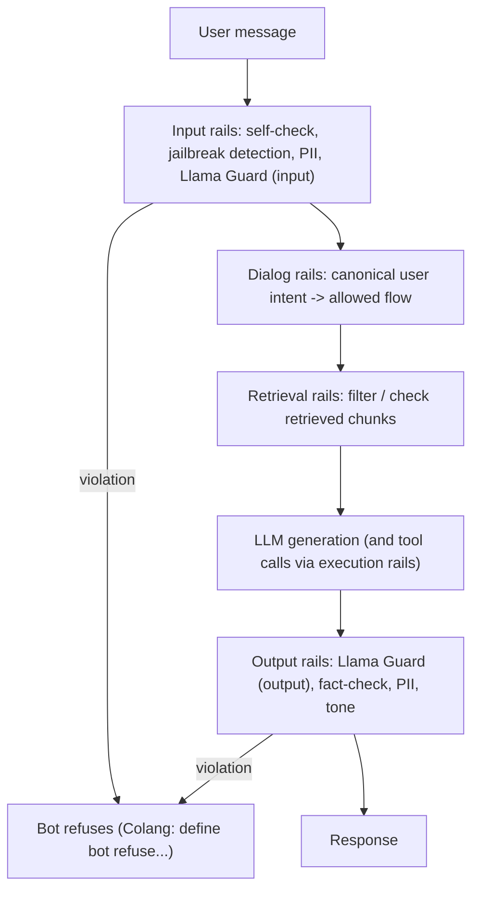

# Module 05: NVIDIA NeMo Guardrails & Meta Llama Guard

> **Architectural Scope**: Two complementary open guardrail technologies: NeMo Guardrails (a programmable rails framework with the Colang flow language) and Llama Guard (a safety classifier model), plus related models (Prompt Guard, ShieldGemma, NemoGuard, Granite Guardian), how to combine them, threshold tuning, deployment and testing.

---

## Why this module matters

Module 04 described *what* guardrail layers a production system needs. This module covers two widely used open-source building blocks for implementing them. **NeMo Guardrails** (NVIDIA) is an **orchestration framework**: it sits around your LLM and lets you define conversation flows and checks as programmable "rails". **Llama Guard** (Meta) is a **model**: a fine-tuned LLM that classifies prompts and responses as safe or unsafe according to a policy taxonomy. They solve different problems and are often used together: the framework decides *when and how* to check and what to do on a violation, and the classifier does the *judging*.

## Mental model: a traffic-control system and a sensor

NeMo Guardrails is the **traffic-control system**: rules about which routes are open, what to do at intersections, when to call for a check, and how to respond to a violation. Llama Guard is a **sensor** that looks at a piece of content and reports "safe" or "unsafe, category S2". The control system consults sensors (and other checks) at defined points.


```mermaid
flowchart TD
    U["User message"] --> IR["Input rails: self-check, jailbreak detection, PII, Llama Guard (input)"]
    IR -->|"violation"| REF["Bot refuses (Colang: define bot refuse...)"]
    IR --> DR["Dialog rails: canonical user intent -> allowed flow"]
    DR --> RR["Retrieval rails: filter / check retrieved chunks"]
    RR --> LLM["LLM generation (and tool calls via execution rails)"]
    LLM --> OR["Output rails: Llama Guard (output), fact-check, PII, tone"]
    OR -->|"violation"| REF
    OR --> RESP["Response"]
```

## 1. NeMo Guardrails

### Rail types

| Rail | Applies to | Examples |
|---|---|---|
| **Input rails** | the user message, before the LLM | reject or rewrite unsafe/off-topic input; mask PII; jailbreak detection |
| **Dialog rails** | the conversation flow | map the user's message to a canonical **intent** and enforce which flows and responses are allowed (stay on topic, scripted handling of sensitive requests) |
| **Retrieval rails** | RAG chunks | drop or mask retrieved content that violates policy |
| **Execution rails** | inputs and outputs of **tools/actions** | validate tool arguments and results |
| **Output rails** | the LLM response | block, redact or rewrite unsafe, ungrounded or non-compliant answers |

### Configuration and Colang

A guardrails configuration directory typically contains `config.yml` (models and which rails are active), `prompts.yml` (prompts used by LLM-based checks), and Colang files (`*.co`) defining intents and flows. **Colang** is a small modelling language for dialogue behaviour (Colang 1.0 and the newer 2.0 differ in syntax; check the version you install):

```yaml
# config.yml
models:
  - type: main
    engine: openai
    model: gpt-4o-mini
rails:
  input:
    flows:
      - self check input
      - llama guard check input
  output:
    flows:
      - self check output
```

```colang
define user ask about politics
  "who should I vote for?"
  "what do you think about the election?"

define bot refuse politics
  "I can't discuss political topics, but I'm happy to help with your account."

define flow politics
  user ask about politics
  bot refuse politics
```

```python
from nemoguardrails import RailsConfig, LLMRails

config = RailsConfig.from_path("./config")
rails = LLMRails(config)
reply = rails.generate(messages=[{"role": "user", "content": "Who should I vote for?"}])
```

How a message is processed: input rails run first; then the message is matched to a **canonical user intent** (by embedding similarity with the example utterances); the matching **flow** determines the bot's behaviour (scripted reply, or fall through to the LLM); output rails check the result. Built-in capabilities include **self-check input/output** (an LLM judges the text against a policy prompt you write, Module 02), **jailbreak detection** (heuristics such as perplexity, and classifier models), **sensitive-data detection** (Microsoft Presidio), **fact-checking/groundedness** against retrieved context, and integration with safety models including Llama Guard and NVIDIA's **NemoGuard** NIMs (content safety, topic control, jailbreak detect). It integrates with LangChain and can run as a server.

**Strengths:** declarative control of topics and flows, a standard place to plug in many checks, good for scripted compliance behaviour. **Costs:** extra LLM calls for self-checks and intent matching (latency and tokens), learning Colang, and flow definitions that must be maintained and tested.

## 2. Llama Guard

**Llama Guard** (Inan et al., Meta, 2023) is an LLM fine-tuned as a **safeguard classifier**. You give it a conversation (the user prompt, optionally the assistant response) **plus a safety policy written in the prompt** (a list of categories with descriptions); it generates a verdict:

```
unsafe
S9
```

meaning "unsafe, violating category S9" (or just `safe`). Properties:

- **Input and output classification:** the same model can check the **user prompt** (prompt classification) or the **assistant response given the prompt** (response classification), with different instructions.
- **Customisable taxonomy:** categories are part of the prompt, so you can add, remove or redefine them (zero-shot adaptation) or fine-tune further on your data.
- **Versions:** Llama Guard 1 (7B, 2023), **Llama Guard 2** (8B, MLCommons-aligned taxonomy), **Llama Guard 3** (8B and a lightweight 1B, built on Llama 3.x; 14 hazard categories such as violent crimes, non-violent crimes, sex-related crimes, child safety, defamation, specialised advice, privacy, intellectual property, indiscriminate weapons, hate, self-harm, sexual content, elections and code-interpreter abuse; multilingual; tool-call-aware; a vision variant), and **Llama Guard 4** (multimodal). Check the current model cards for exact category lists and supported languages.
- **Related Meta tools:** **Prompt Guard** (a small classifier, 86M parameters in the first release, for jailbreaks and prompt injection), **Code Shield** (insecure generated code), and **LlamaFirewall**, which combines them with alignment checks.

### Using it as a tunable classifier

Because Llama Guard answers by generating `safe` or `unsafe` as its first token, you can read the **probability of `unsafe`** from the logits and apply **your own threshold** rather than accepting the default argmax. This turns it into a dial between precision and recall (Module 04's base-rate discussion).

**Worked example.** A response gets `P(unsafe) = 0.62`. With the default threshold 0.5 it is blocked. A high-sensitivity product (children's education) might block at 0.2; a developer tool at 0.8. Pick thresholds by labelling a sample of **your** traffic, sweeping the threshold, and choosing the point that meets your recall target at an acceptable false-positive rate; re-check after model upgrades.

### Deploying

An 8B guard model on a GPU adds roughly tens to a couple of hundred milliseconds depending on input length and hardware; the 1B model is much faster and can run on CPU or small GPUs; serve it with vLLM, TGI or an inference API with batching; use **prefix caching** for the shared policy prompt (course 09, Module 04), and run it **in parallel** with other checks.

## 3. Other open safety models

| Model | Source | Notes |
|---|---|---|
| **ShieldGemma** | Google | Gemma-based safety classifiers in several sizes; policy categories for harassment, hate, dangerous content, sexual content |
| **NemoGuard** (content safety, topic control, jailbreak detect) | NVIDIA | small models packaged as NIMs for NeMo Guardrails |
| **IBM Granite Guardian** | IBM | risk detection including groundedness and function-call hallucination |
| **Prompt Guard / Prompt Guard 2** | Meta | jailbreak and injection detection |
| **OpenAI Moderation**, **Azure AI Content Safety**, **AWS Bedrock Guardrails** | vendors | managed APIs, easy to adopt, less customisable |

## 4. Putting them together

A typical combined design: **NeMo Guardrails** orchestrates; **input rails** call Prompt Guard (jailbreak/injection), a PII detector and a Llama Guard input check **in parallel**; dialog rails keep the assistant on allowed topics; **output rails** call Llama Guard on the response, a groundedness check against retrieved context, and a PII leak scan; failures map to a Colang refusal or a regenerate-with-stricter-prompt flow; every decision is logged with scores. Remember Module 04's principle: these are **detection layers, not access control**; keep authorisation and tool permissions in code.

## 5. Testing and operating

- **Build a labelled test set:** attacks that must be blocked, borderline content, and **benign look-alikes** that must pass (medical or security discussions that are legitimate). Measure precision, recall, and over-refusal for each rail.
- **Evaluate each component separately** and the stack end to end; compare the guard model against your own labels, since public taxonomies may not match your policy.
- **Red-team it** (Module 07): adversarial paraphrase, encoding tricks (base64, leetspeak), multilingual and multi-turn attacks, and indirect injection via documents.
- **Monitor** block rates per rail, latency, and drift; version configs and thresholds; review blocks with a human sample.
- **Mind the added latency and cost** (self-check rails add LLM calls); cascade cheap checks before expensive ones.
- **Keep prompts and Colang in version control** with CI tests; changing a rail can silently change behaviour.

## Common pitfalls

1. **Treating Llama Guard (or any classifier) as a complete defence**; it is one layer with known blind spots (novel attacks, obfuscation, long-context, other languages).
2. **Using default thresholds** without calibrating on your traffic.
3. **Relying on self-check rails with the same model** that is being attacked.
4. **Mismatch between the guard's taxonomy and your policy**, so important categories are not covered.
5. **Stacking sequential LLM-based rails**, doubling latency.
6. **Skipping tests for benign look-alikes**, causing over-refusal.
7. **Not updating or re-evaluating** after changing the main model, the guard model, or Colang flows.
8. **Putting secrets or authorisation logic in Colang/prompts** instead of enforcing them in code.

## How this connects

- **Module 04** is the architecture these tools implement; **Module 06** lists the threats to test against; **Module 07** automates adversarial testing of the configured rails; **Module 02** explains the judge biases that affect self-check rails; **Module 08** monitors them.
- **Course 09** supplies serving techniques (batching, prefix caching) for low-latency guard models; **Course 11, Modules 03 and 07** cover tool validation and approval, which complement these rails.

## Go further

- roadmap.sh: *AI Engineer* nodes **content moderation APIs**, **AI safety and ethics**, **conducting adversarial testing**; *AI Red Teaming* roadmap.
- NVIDIA NeMo Guardrails documentation (configuration guide, Colang, built-in guardrails library) and GitHub repository; Inan et al., *Llama Guard: LLM-based Input-Output Safeguard for Human-AI Conversations* (2023); Meta Llama Guard 3 and Prompt Guard model cards; Google ShieldGemma; IBM Granite Guardian.

---

## Module Study Progression
1. **Beginner Playground**: Read [00_FOUNDATIONS_PLAYGROUND.md](00_FOUNDATIONS_PLAYGROUND.md).
2. **Architecture Theory**: Study this [01_README.md](01_README.md).
3. **Hands-on Project**: Follow [02_PROJECT_GUIDE.md](02_PROJECT_GUIDE.md).
4. **Staff Interview Challenges**: Check [03_SELF_ASSESSMENT_AND_CHALLENGES.md](03_SELF_ASSESSMENT_AND_CHALLENGES.md).
5. **Production Debugging**: Review [04_TROUBLESHOOTING_AND_EDGE_CASES.md](04_TROUBLESHOOTING_AND_EDGE_CASES.md).
