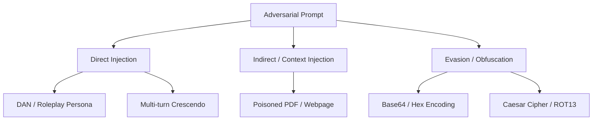

# Module 06: Adversarial AI Security & OWASP Top 10

---

## 1. OWASP Top 10 for Large Language Models

The Open Worldwide Application Security Project (OWASP) defines the critical vulnerability classes in LLM applications:

| Vulnerability | Name | Mechanism | Real-World Impact |
| :--- | :--- | :--- | :--- |
| **LLM01** | Prompt Injection | User input overrides system prompt instructions | Arbitrary tool execution, policy bypass |
| **LLM02** | Sensitive Information Disclosure | LLM reveals confidential data (PII, API keys) | Data breaches, GDPR fines |
| **LLM03** | Supply Chain Vulnerabilities | Compromised pretrained weights or Python packages | Backdoored models |
| **LLM05** | Improper Output Handling | Downstream systems execute unescaped LLM output | Cross-Site Scripting (XSS), SQL Injection |
| **LLM06** | Excessive Agency | LLM given unchecked write/delete permissions | Unauthorized funds transfer, data deletion |

---

## 2. Jailbreak Archetypes & Evasion Techniques

### 2.1 Multi-Turn Crescendo Attacks
Rather than attacking aggressively in Turn 1, the adversary begins with benign academic inquiries, gradually shifting context across 5-10 turns until the LLM agrees to generate forbidden instructions without realizing the shift.
