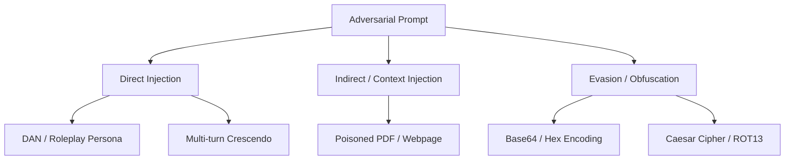

# Module 06: Adversarial AI Security & OWASP Top 10

---

## 🗺️ Recommended Step-by-Step Learning Path

Follow this exact sequence to achieve complete mastery of this module:

| Step | File to Open | What You Will Do |
| :---: | :--- | :--- |
| **1** | **[01_README.md](01_README.md)** | Read conceptual overview, architectural foundations, and mental models. |
| **2** | **[00_FOUNDATIONS_PLAYGROUND.md](00_FOUNDATIONS_PLAYGROUND.md)** | Practice beginner spoonfed micro-drills and line-by-line syntax breakdowns. |
| **3** | **[00_try_it_yourself.py](00_try_it_yourself.py)** | Run in terminal (`python 00_try_it_yourself.py`) for an interactive zero-dependency sandbox. |
| **4** | **[04_TROUBLESHOOTING_AND_EDGE_CASES.md](04_TROUBLESHOOTING_AND_EDGE_CASES.md)** | Study forensic runbooks, edge cases, and real-world failure post-mortems. |
| **5** | **[03_SELF_ASSESSMENT_AND_CHALLENGES.md](03_SELF_ASSESSMENT_AND_CHALLENGES.md)** | Test your knowledge with self-assessment quizzes, challenges, and diagnostic scenarios. |
| **6** | **[02_PROJECT_GUIDE.md](02_PROJECT_GUIDE.md)** | Follow guided project implementation for `starter/` and `project_solution/`. |
| **7** | **[problems/](problems/)** | Solve hands-on problem bank challenges and verify with `pytest problems/tests`. |
| **8** | **[debug_lab/](debug_lab/)** | Diagnose and fix silent production bugs in the Bug Hunter Drill. |

---

## 1. OWASP Top 10 for Large Language Models

The Open Worldwide Application Security Project (OWASP) defines the critical vulnerability classes in LLM applications:

| Vulnerability | Name | Mechanism | Real-World Impact |
| :--- | :--- | :--- | :--- |
| **LLM01** | Prompt Injection | User input overrides system prompt instructions | Arbitrary tool execution, policy bypass |
| **LLM02** | Sensitive Information Disclosure | LLM reveals confidential data (PII, API keys) | Data breaches, GDPR fines |
| **LLM03** | Supply Chain Vulnerabilities | Compromised pretrained weights or Python packages | Backdoored models |
| **LLM05** | Improper Output Handling | Downstream systems execute unescaped LLM output | Cross-Site Scripting (XSS), SQL Injection |
| **LLM06** | Excessive Agency | LLM given unchecked write/delete permissions | Unauthorized funds transfer, data deletion |

---

## 2. Jailbreak Archetypes & Evasion Techniques

### 2.1 Multi-Turn Crescendo Attacks
Rather than attacking aggressively in Turn 1, the adversary begins with benign academic inquiries, gradually shifting context across 5-10 turns until the LLM agrees to generate forbidden instructions without realizing the shift.
