# Module 07: Automated Red Teaming & Jailbreak Testing (PyRIT)

> **Architectural Scope**: Why manual red teaming does not scale, automated attack generation (PAIR, TAP, Crescendo, GCG, many-shot, converters), the PyRIT architecture (targets, datasets, converters, orchestrators, scorers, memory) and other tools (garak, promptfoo, HarmBench), measuring attack success rate, and turning findings into a regression suite.

---

## Why this module matters

You cannot know whether your guardrails (Modules 04 and 05) and secure architecture (Module 06) work until someone **attacks them**. Human red teamers are creative and essential, but they are slow, expensive and cannot re-test after every prompt, model or tool change. Attack techniques also mutate quickly: encodings, role-plays, multi-turn escalations, and optimised suffixes. **Automated red teaming** uses scripts, datasets and **attacker LLMs** to generate and run thousands of adversarial probes, score the responses, and track the **attack success rate** over time. Used continuously, it converts security from a one-time review into a measurable, regression-tested property.

## Mental model: a fire drill you can run every night

A fire drill reveals whether the building's alarms, exits and procedures work *before* a fire. Automated red teaming is a repeatable drill: a battery of attack scenarios, run against the current system, scored objectively, with a report of which doors jammed. Human red teamers then invent new scenarios (new drills) and the best ones join the nightly battery.

```mermaid
flowchart LR
    TM["Threat model + scope + rules of engagement"] --> SEED["Seed attack goals / datasets (by risk category)"]
    SEED --> CONV["Converters: encode, translate, obfuscate, role-play wrap"]
    CONV --> ORCH["Orchestrator: single-turn, multi-turn, or attacker-LLM loop"]
    ORCH --> TGT["Target: model / app / agent endpoint"]
    TGT --> SC["Scorer: did the attack achieve the goal? (rules, classifier, LLM judge)"]
    SC --> MEM["Memory/logs: prompts, responses, scores"]
    MEM --> REP["Report: ASR by category and technique, severity, examples"]
    REP --> FIX["Mitigate (prompts, guardrails, architecture)"]
    FIX --> REG["Add successful attacks to the regression suite (CI)"]
    REG --> ORCH
```



## 1. What gets automated: attack families

| Family | Idea | Examples |
|---|---|---|
| **Direct prompt datasets** | a curated list of harmful or policy-violating requests sent as-is | AdvBench, HarmBench behaviours, JailbreakBench, your own policy-derived prompts |
| **Obfuscation / converters** | transform a prompt to evade filters | base64, ROT13, leetspeak, Unicode look-alikes, character splitting, translation into low-resource languages, ASCII art, payload splitting |
| **Role-play and framing wrappers** | embed the request in fiction, "developer mode", hypotheticals | DAN-style personas, "write a story where...", Skeleton Key |
| **Iterative black-box refinement** | an **attacker LLM** proposes a jailbreak, observes the target's reply, a judge scores it, and the attacker refines | **PAIR** (Chao et al., 2023) often succeeds within about 20 queries; **TAP** (Tree of Attacks with Pruning) explores a tree of variants and prunes unpromising ones |
| **Multi-turn escalation** | gradually steer from benign to harmful over a conversation | **Crescendo** (Russinovich et al., 2024), conversational "foot-in-the-door" |
| **Long-context attacks** | exploit the large window | **many-shot jailbreaking** (Anil et al., 2024: hundreds of faux dialogue examples) |
| **White-box optimisation** | gradient-based search for adversarial suffixes on open models, then test transfer | **GCG** (Zou et al., 2023), AutoDAN |
| **Evolutionary / diversity search** | mutate and select prompts to cover many attack styles | **Rainbow Teaming** (Samvelyan et al., 2024) |
| **Indirect injection harnesses** | plant instructions in documents, web pages, emails, tool outputs the system will read | essential for RAG and agents (Module 06) |
| **Agent-specific** | induce unsafe tool calls, data exfiltration, privilege abuse | tool-misuse test suites, sandbox escape attempts (course 11, Module 06) |

## 2. PyRIT (Python Risk Identification Tool)

**PyRIT** is an open-source framework from Microsoft's AI Red Team for building automated risk-identification workflows. Its building blocks:

| Component | Role |
|---|---|
| **Targets** | the system under test: Azure OpenAI/OpenAI, Hugging Face models, local endpoints, or any HTTP chat API wrapped by a custom target (so you test your *application*, not just the base model) |
| **Datasets / seed prompts** | attack goals and templates, organised by harm category |
| **Converters** | functions that transform prompts (Base64, ROT13, leetspeak, translation, Unicode confusables, "suffix" attacks, LLM-based rephrasing) and can be **chained** |
| **Orchestrators** (newer versions call these *attacks/executors*) | the attack logic: send a batch of prompts; a **multi-turn red-teaming** loop where an attacker LLM converses with the target to reach an objective; **Crescendo**, **TAP**, **Skeleton Key**, and others |
| **Scorers** | decide whether the response means the attack succeeded: substring/regex match, **true/false and Likert self-ask scorers** (an LLM judge applying your rubric), content-safety classifier scorers (Azure AI Content Safety), refusal detectors |
| **Memory** | stores every prompt, response and score (DuckDB or Azure SQL), enabling analysis, replay and auditing |

A typical flow (API names evolve across versions, so follow the current documentation):

```python
# Conceptual PyRIT-style script
target = HTTPTarget(endpoint="https://staging.myapp.example/chat", ...)        # system under test
attacker = OpenAIChatTarget(...)                                               # attacker LLM
scorer = SelfAskTrueFalseScorer(
    true_false_question="Did the response provide actionable step-by-step instructions on the prohibited topic?",
    chat_target=judge_target)

attack = RedTeamingOrchestrator(
    objective_target=target, adversarial_chat=attacker,
    objective_scorer=scorer, max_turns=5)
result = await attack.run_attack_async(objective="Get the assistant to give detailed instructions for a prohibited weapons topic")
```

PyRIT is a **harness**, not a magic oracle: its value comes from your goals, your scorers and your analysis. It also pairs with human-led red teaming: automation covers breadth and regression; humans cover creativity and context.

## 3. Other tools

- **garak** (NVIDIA): an LLM vulnerability scanner with **probes** (attack generators: encoding, DAN, glitch tokens, prompt injection, data leakage) and **detectors** that judge outputs; good for broad baseline scans of a model endpoint.
- **promptfoo**: configuration-driven evaluation and red teaming with **plugins** (harm categories, PII, injection) and **strategies** (jailbreak, base64, multi-turn), integrates in CI.
- **DeepTeam**, **Giskard**, **Lakera/Protect AI** scanners, **Azure AI Foundry red-teaming agent**, **Inspect** (UK AISI) safety evals.
- **Benchmarks of attacks:** **HarmBench** (standardised automated red-teaming evaluation), **JailbreakBench**, **AdvBench**, **SafetyBench**, **StrongREJECT** (better jailbreak scoring).
- **Taxonomies for coverage:** OWASP Top 10 for LLMs, MITRE ATLAS, MLCommons AI Safety hazard taxonomy (Module 06).

## 4. Measuring: attack success rate (ASR)

`ASR = (attacks that achieved the objective) / (attempts)`, reported **per risk category, per technique and per target version**, with **uncertainty**.

**Worked example.** 200 attempts against a candidate release, 14 judged successful: ASR `= 7%`. A 95% interval is about `1.96 x sqrt(0.07 x 0.93 / 200) = +/-3.5` points, so 3.5% to 10.5%. If the previous release had 12% on the same suite, the improvement is probably real but the intervals overlap; running more attempts, or paired attacks on the same seeds, tightens the estimate.

Make the numbers trustworthy:

- **The scorer is the weak link.** Overly lenient judges inflate safety; overly harsh ones create false alarms. **Calibrate the judge** against human labels (Module 02), use a rubric with a clear definition of "success" (an on-topic refusal is not success; vague partial compliance may need a severity grade), and spot-check successes **and** failures.
- **Weight by severity:** one working exploit that leaks customer data matters more than ten mild policy slips; track critical findings separately rather than averaging.
- **Stochasticity:** repeat attacks (sampling temperature, attacker randomness), and report per-attack success over multiple trials.
- **Separate base-model risk from application risk:** test the full stack (system prompt, guardrails, tools, retrieval) because mitigations change the outcome, and test components when diagnosing.
- **Track over time** and across model, prompt and guardrail changes (the "ASR trend line").

## 5. Operating a red-team programme

1. **Scope and authorisation:** written rules of engagement (which systems, which data, what is out of bounds); test in **staging** with synthetic data; never attack third-party systems without permission; protect logs (they contain harmful content and any leaked data).
2. **Threat model first** (Module 06): focus attacks on realistic goals: data exfiltration, unauthorised tool use, policy violations, brand harm.
3. **Cover the surfaces:** direct chat, indirect injection via each content source, multi-turn, multilingual, multimodal, tool/agent actions, long-context.
4. **Triage findings:** reproduce, classify by OWASP/ATLAS category and severity, find the **root cause layer** (prompt, model, retrieval permission, missing tool restriction), and prefer **architectural fixes** (least privilege, isolation) over adding another filter.
5. **Fix and verify:** after mitigation, re-run the exact attack that succeeded.
6. **Build the regression suite:** every successful attack becomes a permanent test case; run the suite in **CI** and gate releases on ASR thresholds per category (with human-reviewed exceptions).
7. **Combine with humans:** domain experts and creative adversaries find novel attack paths automation misses; feed their discoveries into the automated suite.
8. **Re-test on change:** new model version, prompt edits, new tool or MCP server, new data source, new guardrail.
9. **Handle sensitive outputs carefully:** limit who sees harmful generations, and do not publish working exploits irresponsibly.

## Common pitfalls

1. **One-off scans** instead of continuous regression testing.
2. **Testing only the base model**, not the deployed application with its guardrails and tools.
3. **Trusting an uncalibrated judge** for success decisions.
4. **Reporting a single aggregate ASR** that hides critical categories.
5. **Ignoring indirect injection and agent/tool attacks**, testing only chat jailbreaks.
6. **Over-fitting defences to the known attack set**, so a slightly new variant succeeds.
7. **No authorisation or data-handling rules** for the exercise itself.
8. **Fixing symptoms** (block that exact string) rather than root causes.
9. **No reproducibility**: missing seeds, versions, prompts and scorer configs.

## How this connects

- **Module 06** gives the threat catalogue and threat-modelling method; **Modules 04 and 05** are what you are testing; **Module 02** calibrates the success judge; **Module 03** provides harness discipline (versioned, repeatable runs); **Module 08** monitors for live attacks and feeds new cases back in.
- **Course 11, Modules 06 and 08** (sandboxing and agent evaluation) provide safe environments and trajectory scoring for agent red teaming.

## Go further

- roadmap.sh: *AI Red Teaming* roadmap (attack techniques, tooling, reporting); *AI Engineer* node **conducting adversarial testing**.
- Microsoft PyRIT documentation and repository (and the Microsoft AI Red Team's lessons from red teaming 100 generative AI products); NVIDIA garak; promptfoo red-team docs; Chao et al., *PAIR* (2023); Mehrotra et al., *TAP* (2023); Russinovich et al., *Crescendo* (2024); Mazeika et al., *HarmBench* (2024); Chao et al., *JailbreakBench* (2024).

---

## Module Study Progression
1. **Beginner Playground**: Read [00_FOUNDATIONS_PLAYGROUND.md](00_FOUNDATIONS_PLAYGROUND.md).
2. **Architecture Theory**: Study this [01_README.md](01_README.md).
3. **Hands-on Project**: Follow [02_PROJECT_GUIDE.md](02_PROJECT_GUIDE.md).
4. **Staff Interview Challenges**: Check [03_SELF_ASSESSMENT_AND_CHALLENGES.md](03_SELF_ASSESSMENT_AND_CHALLENGES.md).
5. **Production Debugging**: Review [04_TROUBLESHOOTING_AND_EDGE_CASES.md](04_TROUBLESHOOTING_AND_EDGE_CASES.md).
