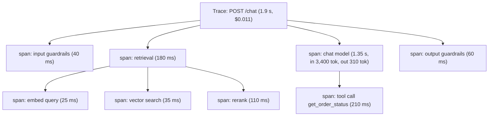

# Module 08: Production AI Observability & OpenTelemetry Tracing

> **Architectural Scope**: What to observe in LLM applications (traces, metrics, logs, evaluation scores, cost), OpenTelemetry concepts and the GenAI semantic conventions, instrumenting RAG and agent pipelines, the tool landscape (OpenLLMetry, OpenInference, LangSmith, Langfuse, Phoenix, Helicone), sampling, privacy, dashboards and alerts, and closing the loop into evaluation.

---

## Why this module matters

Once an LLM application is live, you face failures that unit tests never saw: a retrieval step that silently returns nothing, a prompt change that doubles token spend, a tool that times out one call in fifty, an agent that loops, a guardrail that starts blocking legitimate users, or quality that degrades because the provider updated the model. Because LLM behaviour is non-deterministic and multi-step, **you cannot debug from the final answer alone**. You need to see *inside* each request: which documents were retrieved, what prompt was sent, how many tokens it used, how long each step took, which tools were called with what arguments, and what the guardrails decided. **Observability** is that visibility, and **OpenTelemetry (OTel)** is the vendor-neutral standard for collecting it.

## Mental model: a flight data recorder for every request

An aircraft records sensor readings, pilot actions and system states continuously, so investigators can reconstruct any flight. A **trace** is the flight recording for one request: a tree of timed steps (**spans**) from the user's message to the final answer, with the inputs, outputs, costs and errors of each step attached. **Metrics** are the cockpit dashboard (aggregate health over time). **Logs and events** are the detailed notes. **Evaluation scores** attached to traces are the post-flight quality review.



## 1. The four signals

| Signal | What it captures | Examples for LLM apps |
|---|---|---|
| **Traces** | causal, timed tree of operations for one request | spans for retrieval, reranking, each LLM call, each tool call, guardrail checks, agent steps/loops |
| **Metrics** | aggregated numbers over time | request rate, error rate, latency p50/p95/p99, **time to first token and inter-token latency** (course 09), **tokens in/out**, **cost**, cache hit rate, guardrail block rate, retrieval hit rate, queue depth |
| **Logs / events** | discrete records | prompts and completions (carefully, see privacy), errors, tool arguments, guardrail verdicts |
| **Evaluations / feedback** | quality scores and user signals linked to traces | LLM-judge scores (groundedness, relevance), thumbs up/down, edits, escalations, task success |

LLM-specific questions each signal answers: *Why was this answer wrong?* (trace: retrieved the wrong chunk, or the context was truncated); *Why did cost spike?* (metrics by prompt version, user, feature); *Is quality drifting?* (sampled evaluation scores over time); *Are we being attacked?* (guardrail block patterns, unusual token use).

## 2. OpenTelemetry in a nutshell

- **Trace / span:** a trace is identified by a trace ID; each span has a span ID, parent ID, name, start/end time, status, **attributes** (key-value metadata), and events. Spans nest to form the tree.
- **Context propagation:** the trace context (the W3C `traceparent` header) is passed across services, async tasks, queues and tool calls so that one request's spans from many components join a single trace.
- **SDK and exporters:** your code (or an auto-instrumentation library) creates spans; an **exporter** sends them via **OTLP** to an **OpenTelemetry Collector**, which processes (batching, sampling, redaction) and forwards to a backend: Jaeger, Grafana Tempo, Honeycomb, Datadog, New Relic, or LLM-specific platforms (Langfuse, Phoenix, LangSmith).
- **Vendor neutrality:** instrumenting once with OTel avoids lock-in to a single observability vendor.

### GenAI semantic conventions

The OTel **GenAI semantic conventions** (still evolving; check the current spec) standardise attribute names for LLM calls so tools can interpret them. Commonly seen attributes:

| Attribute | Meaning |
|---|---|
| `gen_ai.operation.name` | `chat`, `text_completion`, `embeddings`, `execute_tool`, `invoke_agent`, ... |
| `gen_ai.provider.name` (earlier `gen_ai.system`) | e.g. `openai`, `anthropic` |
| `gen_ai.request.model` / `gen_ai.response.model` | requested vs actual model |
| `gen_ai.request.temperature`, `.max_tokens`, `.top_p` | sampling parameters |
| `gen_ai.usage.input_tokens`, `gen_ai.usage.output_tokens` | token usage (the basis for cost) |
| `gen_ai.response.finish_reasons` | `stop`, `length`, `tool_calls`... |
| prompt/completion content | optional **events** or attributes, off by default because content is sensitive |

Agent and tool spans (`invoke_agent`, `execute_tool`) let you view an agent's reasoning loop as a trace tree.

## 3. Instrumenting an application

```python
from opentelemetry import trace
tracer = trace.get_tracer("support-bot")

def answer(question, user_id):
    with tracer.start_as_current_span("rag.request") as root:
        root.set_attribute("app.user_hash", hash_user(user_id))
        root.set_attribute("app.prompt_version", PROMPT_VERSION)

        with tracer.start_as_current_span("retrieval") as s:
            docs = retrieve(question, k=20)
            s.set_attribute("retrieval.top_k", 20)
            s.set_attribute("retrieval.returned", len(docs))
            s.set_attribute("retrieval.top_score", docs[0].score if docs else 0.0)

        with tracer.start_as_current_span("chat gpt-4o") as s:
            s.set_attribute("gen_ai.operation.name", "chat")
            s.set_attribute("gen_ai.request.model", "gpt-4o")
            resp = llm(build_prompt(question, docs))
            s.set_attribute("gen_ai.usage.input_tokens", resp.usage.input_tokens)
            s.set_attribute("gen_ai.usage.output_tokens", resp.usage.output_tokens)
            s.set_attribute("gen_ai.response.finish_reasons", [resp.finish_reason])
        return resp.text
```

In practice, use **auto-instrumentation** where available: **OpenLLMetry** (Traceloop) and **OpenInference** (Arize) patch OpenAI, Anthropic, LangChain, LlamaIndex, vector DB and framework clients to emit OTel spans automatically; **LangSmith** and **Langfuse** provide SDKs and OTel-compatible ingestion; **Helicone** works as a **proxy/gateway** that logs requests with almost no code change; **Arize Phoenix**, **Braintrust**, **W&B Weave** and **Datadog LLM Observability** are other options. Add **custom spans and attributes** for your own steps (retrieval scores, guardrail verdicts, agent iteration number, tool arguments).

Instrument every layer you have built: **retrieval** (query, filters, scores, latency), **reranking**, **LLM calls** (model, params, tokens, finish reason, TTFT), **tools** (name, arguments, result size, error), **guardrails** (which rail fired, scores), **agent loops** (iteration, decision), **cache** (hit/miss), and **business context** (tenant, feature, prompt/model/index version, experiment arm).

## 4. Cost, latency and quality metrics

- **Cost per request** `= input_tokens x price_in + output_tokens x price_out` (+ embeddings, reranker, tool/API costs); aggregate by feature, tenant, prompt version and model to find where money goes. **Worked example:** 3,400 input and 310 output tokens at `$3`/M and `$15`/M is `0.0102 + 0.00465 = $0.015` per call; at 200,000 requests a day that is about `$3,000/day`, and a prompt change that adds 1,000 tokens of context raises it by about `$600/day`, which the cost dashboard should surface the day it ships.
- **Latency breakdown:** the trace shows whether time goes to retrieval, the model, tools or guardrails. Track **TTFT** and **inter-token latency** for streaming UX (course 09).
- **Quality metrics online:** run **sampled automatic evaluators** (groundedness, relevance, policy compliance, LLM-judge calibrated per Module 02) on a percentage of live traces and chart them; combine with **user feedback**.
- **Reliability metrics:** error rate by type (provider errors, timeouts, schema failures, tool errors), retry counts, step-limit hits, loop detection.
- **Safety metrics:** guardrail trigger rates per category, blocked vs allowed, anomaly scores (spikes can mean an attack, Modules 06 and 07).

## 5. Sampling, privacy and retention

- **Sampling:** tracing every request is expensive at scale. **Head sampling** (decide at the start, e.g. 10%) is simple; **tail sampling** (decide after the trace completes, in the Collector) lets you **keep all errors, slow requests, low-quality or flagged traces** and sample the healthy majority.
- **Privacy:** prompts and completions often contain **PII, secrets and confidential data**. Options: don't log content by default; **redact** (PII scrubbing in the Collector or SDK); hash identifiers; separate sensitive content storage with stricter access control and short retention; honour deletion requests; comply with data-residency rules. Vendors and self-hosted backends differ here; verify.
- **Retention and access:** define retention by signal (metrics long, full content short); restrict who can view raw conversations; audit access.
- **Cardinality:** don't put unbounded values (raw user IDs, full prompts) in **metric labels**; keep them in trace attributes.
- **Overhead:** instrumentation should add negligible latency; export asynchronously and in batches.

## 6. Dashboards, alerts and the improvement loop

**Dashboards:** traffic, error rate, latency (p50/p95/p99, TTFT), tokens and cost (by model/feature/prompt version), cache hit rate, retrieval metrics (empty results, top score distribution), guardrail rates, quality scores, user feedback, per-tenant views.

**Alerts** (on symptoms users feel and on budgets): error rate above threshold, p95 latency or TTFT above SLO, **cost per day or per request** anomaly, **quality score drop**, spike in guardrail blocks or refusals, step-limit hits for agents, tool failure rate, provider outages. Prefer **SLO-based alerts** (burn rate) over raw thresholds (course 04 and course 09, Module 09).

**Debugging workflow:** an alert or user complaint leads to finding the **trace**, inspecting spans (what was retrieved? what prompt? which tool failed?), forming a hypothesis, reproducing with the recorded inputs, fixing, and verifying.

**Closing the loop:** sample failed or low-scoring traces into your **evaluation dataset** (Module 01), add confirmed attacks to the **red-team regression suite** (Module 07), A/B test prompt or model changes with traces tagged by experiment arm, and tie every trace to the **prompt, model, index and code versions** so regressions can be bisected. This turns production into a continuous source of test cases.

## Worked example: finding a cost and quality regression

Monday's dashboard shows cost per request up 38% and groundedness down from 0.91 to 0.84 since a Friday deploy. Filtering traces by `app.prompt_version` shows the new version averages 2,900 more input tokens: the retrieval span's `retrieval.returned` rose from 5 to 20 passages because `top_k` was changed during a refactor. In sampled low-groundedness traces, the answer-relevant passage sits in the middle of the 20 (course 10, Module 09: "lost in the middle"), and the model cites an irrelevant one. Fix: restore `top_k = 5` with reranker threshold; the next day's metrics return to baseline, the failing traces are added to the regression set, and an alert on `retrieval.returned` and cost per request prevents a repeat.

## Common pitfalls

1. **Logging only final answers**, not the intermediate steps where failures originate.
2. **Not recording versions** (prompt, model, index, code), so regressions cannot be attributed.
3. **Storing raw prompts and completions indefinitely** without PII controls.
4. **High-cardinality metric labels** that overwhelm the metrics backend.
5. **No cost or token tracking** until the bill arrives.
6. **Sampling uniformly** and losing the rare errors and bad traces you care about (use tail sampling).
7. **Alerting on averages** while tail latency and rare failures hurt users.
8. **Treating observability as separate from evaluation**: traces should feed datasets and judges.
9. **Not propagating trace context** across async queues, tools and services, producing fragmented traces.

## How this connects

- **Module 01 and 02** define the quality metrics and judges that run on sampled traces; **Modules 04 to 07** supply guardrail and security signals to monitor; **Module 03** informs offline regression suites fed by production failures.
- **Course 09, Modules 01 and 09** (TTFT/TPOT, SLOs, autoscaling) use the same latency and queue metrics; **Course 11, Module 08** (agent evaluation) depends on trace trees; **Course 04, Module 25** (observability, distributed tracing, SRE) provides the general foundations.

## Go further

- roadmap.sh: *AI Engineer* nodes **cost / latency monitoring**, **observability**, **Helicone**, **LangSmith**; *AI Agents* nodes **OpenLLMetry**, **DeepEval**, **Helicone**; *MLOps* **monitoring** nodes.
- OpenTelemetry documentation (traces, context propagation, Collector) and the **GenAI semantic conventions** specification; Traceloop OpenLLMetry and Arize OpenInference docs; Langfuse, LangSmith, Arize Phoenix and Helicone documentation; Google SRE book, *Monitoring Distributed Systems*.

---

## Module Study Progression
1. **Beginner Playground**: Read [00_FOUNDATIONS_PLAYGROUND.md](00_FOUNDATIONS_PLAYGROUND.md).
2. **Architecture Theory**: Study this [01_README.md](01_README.md).
3. **Hands-on Project**: Follow [02_PROJECT_GUIDE.md](02_PROJECT_GUIDE.md).
4. **Staff Interview Challenges**: Check [03_SELF_ASSESSMENT_AND_CHALLENGES.md](03_SELF_ASSESSMENT_AND_CHALLENGES.md).
5. **Production Debugging**: Review [04_TROUBLESHOOTING_AND_EDGE_CASES.md](04_TROUBLESHOOTING_AND_EDGE_CASES.md).
