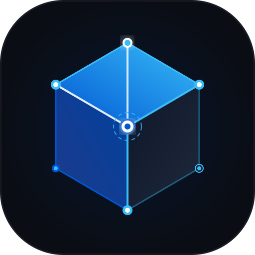

<p align="center">
  
</p>

# AI Systems Mastery: The Principal Architect & Engineering Academy

[](#detailed-curriculum-matrix)
[](#detailed-curriculum-matrix)
[](#-live-python-runner--side-by-side-scratchpad)
[-emerald.svg)](#quality--integrity-guarantee)
[](#quality--integrity-guarantee)
[](#-zero-setup-1-click-launch)
[](#-copyright--author)

> **A comprehensive, production-grade 12-course curriculum engineered to take software engineers and ML practitioners from first principles to the Principal AI Systems Architect / Staff ML Infrastructure tier.**
>
> **Built for all types of learners and curated for everyone who is interested:** Whether you are taking your first steps in computer science with beginner-friendly interactive playgrounds, or you are an experienced engineer mastering low-level cache-line layout, distributed Raft consensus, CUDA/Triton FP8 kernels, and multi-agent cognitive swarms—this curriculum was designed from the ground up for clarity, depth, and practical execution.

---

## ⚡ Zero-Setup 1-Click Launch

This repository includes a standalone, self-hosted **Coursera-style learning platform** designed with an ultra-clean, enterprise architectural aesthetic (inspired by Linear, Vercel, and Stripe). **Zero setup or configuration is required.**

### Launching the Platform

* **Windows (Native Executable)**: Simply double-click **`Launch_Academy.exe`** in the repository root.
* **Windows (Batch Launcher)**: Double-click **`Launch_Academy.bat`**.
* **Linux / macOS**: Run **`./Launch_Academy.sh`** or **`python start_platform.py`**.

```
+-----------------------------------------------------------------------------------------+
|                                🚀 ZERO MANUAL SETUP                                     |
|  * Automatically locates Python across PATH, AppData, and System directories            |
|  * Auto-installs missing dependencies (FastAPI, Uvicorn) on first run                   |
|  * Embedded Native Fallback Server guarantees instant offline operation                 |
|  * Pre-compiled React frontend: No Node.js or npm required                              |
|  * Automatically opens http://localhost:8000 in your default browser                    |
+-----------------------------------------------------------------------------------------+
```

---

## 🖥️ Live Python Runner & Side-by-Side Scratchpad

Learn interactively without ever leaving the lesson:
* **Side-by-Side Split View**: Keep reading on the left while editing, testing, and running Python code on the right.
* **1-Click "▶ Run" on Any Lesson Code Block**: Every code snippet in the curriculum features a **`▶ Run`** button. Clicking it automatically opens the side runner, loads the code snippet, and executes it in an isolated subprocess.
* **Real-time Terminal Output**: Inspect stdout, stderr, execution duration, and exit status immediately.
* **Built-in Architecture Presets**: Quickly load and run FLOPs/Roofline estimators, KV-Cache memory calculators, and Scaled Dot-Product attention simulations.
* **Keyboard Shortcuts**: Hit `Ctrl + Enter` (or `Cmd + Enter`) anywhere in the code editor to execute instantly.

---

## 🧭 The Recommended 12-Course Learning Path

Follow the courses in strict numerical order (`01_` through `12_`). The progression moves from software craftsmanship to low-level distributed storage, up through mathematical foundations, down to bare-metal GPU kernels, and out into cluster-scale distributed training, high-throughput inference engines, and autonomous cognitive systems.

```
+---------------------------------------------------------------------------------------------------+
|                                    THE 12-COURSE MASTER SUITE                                     |
+---------------------------------------------------------------------------------------------------+
| TIER 1: SOFTWARE CRAFTSMANSHIP & DISTRIBUTED SYSTEMS                                              |
|  01. [Advanced Python](01_Advanced_Python/README.md)                                              |
|      Asyncio, concurrency, C-extensions, memory profiling, CPython internals (27 Modules)        |
|  02. [Data Structures & Algorithms](02_Data_Structures_and_Algorithms/README.md)                  |
|      DSA to Staff/FAANG level, plus string matching and network flow (17 Modules)                 |
|  03. [Databases & Storage Engines](03_Databases_and_Storage_Engines/README.md)                    |
|      Postgres MVCC, Mongo Replica Sets, Redis, Cassandra Ring, LSM-Trees, Raft (25 Modules)       |
|  04. [System Design & Distributed Systems](04_System_Design_and_Distributed_Systems/README.md)   |
|      Microservices, event streaming, caching, API gateways, high availability (27 Modules)       |
+---------------------------------------------------------------------------------------------------+
| TIER 2: MATHEMATICAL & DEEP LEARNING FOUNDATIONS                                                  |
|  05. [Mathematics for Machine Learning & AI](05_Mathematics_for_ML_and_AI/README.md)              |
|      Linear algebra, SVD, multivariable calculus, probability, optimization (12 Modules)          |
|  06. [Deep Learning & AI Research Foundations](06_Deep_Learning_and_AI_Foundations/README.md)      |
|      PyTorch, TensorFlow, scratch neural nets, transformers, RL, toy LLM, LoRA (12 Modules)       |
+---------------------------------------------------------------------------------------------------+
| TIER 3: HARDWARE, KERNEL & DISTRIBUTED INFRASTRUCTURE (HIGH-PAYING INFRA TIER)                    |
|  07. [GPU Programming & AI Kernels](07_GPU_Programming_and_AI_Kernels/README.md)                 |
|      CUDA C++, OpenAI Triton, fused operators, FlashAttention-3, NCU rooflines (11 Modules)      |
|  08. [Distributed Training & GPU Infrastructure](08_Distributed_Training_and_GPU_Infrastructure/README.md)|
|      Megatron 3D Parallelism, DeepSpeed ZeRO-3, FSDP, Ring Attention, InfiniBand (10 Modules)     |
|  09. [AI Inference Systems & Serving Engines](09_Inference_Systems_and_Serving_Engines/README.md) |
|      vLLM PagedAttention, SGLang RadixAttention, Continuous Batching, FP8/FP4 (9 Modules)        |
+---------------------------------------------------------------------------------------------------+
| TIER 4: APPLIED COGNITIVE & ENTERPRISE AI ARCHITECTURES                                           |
|  10. [Advanced Retrieval & Context Engineering](10_Advanced_Retrieval_and_Context_Engineering/README.md)|
|      ColBERTv2 Late Interaction, Microsoft GraphRAG, Vector DB HNSW/DiskANN (9 Modules)          |
|  11. [Autonomous Agents & Cognitive Architectures](11_Autonomous_Agents_and_Cognitive_Architectures/README.md)|
|      LangGraph state machines, multi-agent swarms, sandboxed microVMs, SWE-bench (8 Modules)     |
|  12. [LLM Evaluation Science, Guardrails & Safety](12_LLM_Evaluation_Science_and_Guardrails/README.md)|
|      RAGAS metrics, LLM-as-a-judge bias mitigation, NeMo Guardrails, Red Teaming (8 Modules)     |
+---------------------------------------------------------------------------------------------------+
```

---

## 📊 Detailed Curriculum Matrix

| Track | Course Directory | Modules | Status | Core Architecture Covered |
| :---: | :--- | :---: | :---: | :--- |
| **01** | [01_Advanced_Python](01_Advanced_Python/README.md) | 27 | Verified | Concurrency, Asyncio, Memory Profiling, C-Extensions, Packaging |
| **02** | [02_Data_Structures_and_Algorithms](02_Data_Structures_and_Algorithms/README.md) | 17 | Verified | Cache-friendly DSA, Trees, Graphs, DP, Bloom Filters, KMP/Aho-Corasick, Max-Flow |
| **03** | [03_Databases_and_Storage_Engines](03_Databases_and_Storage_Engines/README.md) | 25 | Verified | Storage Engines, MVCC, Relational, NoSQL, LSM Trees, Sharding |
| **04** | [04_System_Design_and_Distributed_Systems](04_System_Design_and_Distributed_Systems/README.md) | 27 | Verified | Scale Math, Load Balancing, Caching, Event Streaming, Raft |
| **05** | [05_Mathematics_for_ML_and_AI](05_Mathematics_for_ML_and_AI/README.md) | 12 | Verified | Linear Algebra, SVD, Vector Calculus, Joint Distributions, Covariance |
| **06** | [06_Deep_Learning_and_AI_Foundations](06_Deep_Learning_and_AI_Foundations/README.md) | 12 | Verified | Scratch NNs, PyTorch/TF, Attention, RL, Small LLMs, LoRA Fine-Tuning |
| **07** | [07_GPU_Programming_and_AI_Kernels](07_GPU_Programming_and_AI_Kernels/README.md) | 11 | Verified | CUDA C++, OpenAI Triton, Fused LayerNorm, FlashAttention-3, NCU |
| **08** | [08_Distributed_Training_and_GPU_Infrastructure](08_Distributed_Training_and_GPU_Infrastructure/README.md) | 10 | Verified | Megatron-LM 3D Parallelism, DeepSpeed ZeRO, FSDP, Ring Attention, NCCL |
| **09** | [09_Inference_Systems_and_Serving_Engines](09_Inference_Systems_and_Serving_Engines/README.md) | 9 | Verified | vLLM PagedAttention, Continuous Batching, Disaggregated Serving, FP8 |
| **10** | [10_Advanced_Retrieval_and_Context_Engineering](10_Advanced_Retrieval_and_Context_Engineering/README.md) | 9 | Verified | ColBERTv2, Microsoft GraphRAG, HNSW/DiskANN, Hybrid Search RRF |
| **11** | [11_Autonomous_Agents_and_Cognitive_Architectures](11_Autonomous_Agents_and_Cognitive_Architectures/README.md) | 8 | Verified | LangGraph State Graphs, Tool Calling, Multi-Agent Swarms, Firecracker |
| **12** | [12_LLM_Evaluation_Science_and_Guardrails](12_LLM_Evaluation_Science_and_Guardrails/README.md) | 8 | Verified | RAGAS, LLM-as-a-Judge, NeMo Guardrails, OWASP Top 10 Red Teaming |

---

## 🏛️ Standardized Module Layout

Every single module across all 12 courses adheres to a uniform pedagogical blueprint:

| Artifact | Purpose & Depth |
| :--- | :--- |
| `00_FOUNDATIONS_PLAYGROUND.md` | Intuitive, beginner-accessible entry point with zero prerequisites |
| `01_README.md` | Systems theory, CPython/OS memory layout, complexity proofs, architecture diagrams |
| `*_PROJECT_GUIDE.md` | Hands-on 3-tier build from zero to production implementation |
| `*_SELF_ASSESSMENT_AND_CHALLENGES.md` | Staff-level interview scenario challenges, debugging drills, and diagnostics |
| `*_TROUBLESHOOTING_AND_EDGE_CASES.md` | Production failure modes, race conditions, memory leaks, and fixes |
| `starter/` | Stubs and interfaces enforcing the specification |
| `project_solution/` | Production reference implementation with complete automated test suite |
| `debug_lab/` | Planted defects that exit 0 and produce plausible wrong answers for debugging mastery |

---

## 🛡️ Quality & Integrity Guarantee

* **Zero Broken Links**: 5,812 internal links verified across all 12 courses via strict link validation. Every link works reliably on a fresh clone.
* **1,609 Automated Tests**: 100% passing test suite across all 12 courses verified by pytest with zero warnings and zero failures.
* **Strict Code Quality**: Zero Ruff linter errors or warnings across the entire repository.
* **No Unimplemented Stubs**: Every single exercise, project, and benchmark is fully coded and runnable out of the box.

---

## 💻 Manual Development & Quick Start

If you wish to run the platform in developer mode:

```bash
# 1. Clone the repository
git clone https://github.com/reddykarthikeya1/AI-Systems-Mastery.git
cd AI-Systems-Mastery

# 2. Run the platform launcher
python start_platform.py

# Or launch backend directly:
uvicorn learning_platform.server.main:app --host 127.0.0.1 --port 8000 --reload
```

---

## 📜 Copyright & Author

**AI Systems Mastery** is designed, authored, and maintained by **Karthikeya Reddy**.

```
Copyright (c) Karthikeya Reddy. All rights reserved.
```
