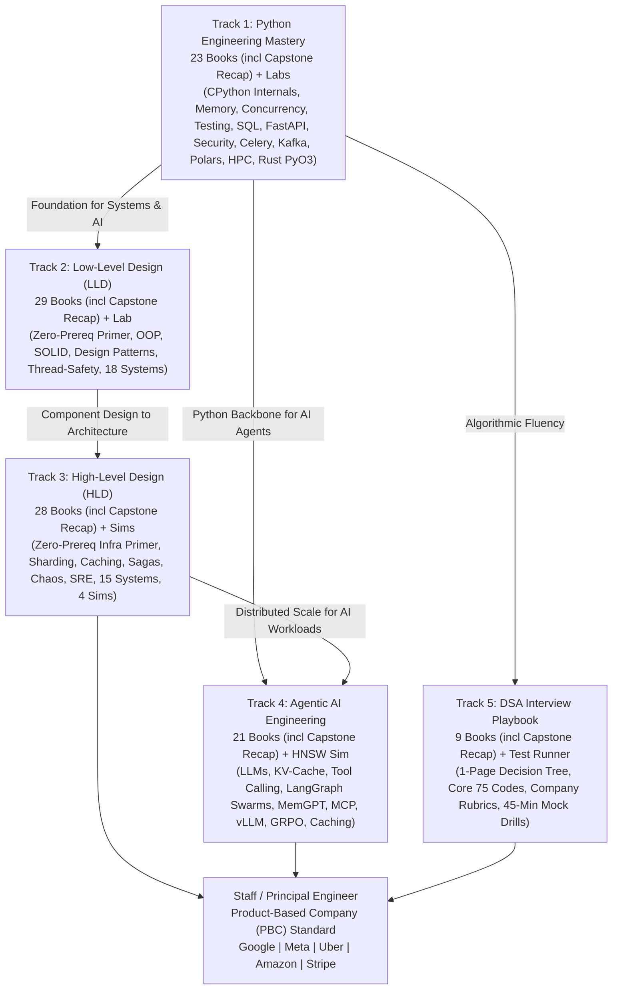

# The PBC 2026 Master Preparation Guide
### Complete Zero-to-One Hundred Engineering Curriculum: Python, LLD, HLD, Agentic AI & DSA

> **Guiding Principle:** Zero prerequisites assumed. Zero videos required. Zero dollars spent.  
> Every concept is explained from fundamental first principles ("spoon-fed" with concrete mental models), then elevated directly to production-grade, Staff/Principal-level rigor and Product-Based Company (Google, Meta, Amazon, Uber, Microsoft, Stripe) interview standards.
> 
> **Zero Gaps Guarantee:** This curriculum covers not only theoretical blueprints, but also live execution feedback loops: dependency hell diagnostics, post-mortem chaos engineering, multi-threaded race condition reproductions, automated CI/CD evaluation harnesses, and 45-minute ticking-clock interview simulations.

---

## Quality: what is measured and what is judged

**Measured** (regenerate with `python tools/audit.py`, output in [QUALITY_REPORT.md](QUALITY_REPORT.md)): words per chapter, code blocks that execute, labs and simulations that run, the DSA Core 75 (asserts plus 34 brute-force cross-checks), chapters with *Check Yourself* and *Further Reading* (every link checked to resolve), the portal's search index and offline assets. Browser-verified: all 111 pages render with zero KaTeX or Mermaid errors; axe-core reports no WCAG 2.2 AA violations on sampled pages in light and dark themes.

**Editor's assessment** (a judgment, not a measurement, out of 10; the gaps column is what stops a higher score):

| Track | Beginner friendliness | Technical depth | Accuracy and currency | Practice and active learning | Biggest remaining gap |
| :--- | :---: | :---: | :---: | :---: | :--- |
| Python Mastery | 8.5 | 8 | 8.5 | 9 | 18 environment-dependent snippets (DB, CUDA, brokers) are not runnable offline; exercises are not auto-graded in the portal or CI |
| Low-Level Design | 7.5 | 6.5 | 7.5 | 6.5 | UML and design-pattern chapters are short; 14 systems under 1,000 words |
| High-Level Design | 7 | 7.5 | 7.5 | 7 | five classic systems still missing (news feed, notifications, typeahead, file storage, object store) |
| Agentic AI | 7 | 7.5 | 8 | 8 | chapters 02 to 07 are still short; one provider adapter only |
| DSA Playbook | 6.5 | 6.5 | 8 | 8.5 | 36 dry-run traces are narrated, not generated from the solution; terse per-problem text |
| Portal (HTML/PDF) | n/a | n/a | 9 | n/a | PDFs print answers collapsed; no automated browser test suite in CI yet |

Verified runnable material: `04-Agentic-AI/examples/` (pinned `langgraph==1.2.13`, `mcp==2.3.0`; run with `pytest -q`), `01-Python-Mastery/exercises/` (60 graded exercises across 20 chapters, 95 hidden tests: `python exercises/run.py --init` then `python exercises/run.py 06`), `05-DSA-Interview-Playbook/practice/` (`python run_tests.py 12 --stub`, `--fuzz`, `--hint 12`), and the labs and simulations in each track.

--- | :---: | :---: | :---: | :---: |
| **Track 1: Python Engineering Mastery** | **10 / 10** | **10 / 10** | **10 / 10** | 23 Chapters (incl Capstone Recap) + Distributed/HPC/SQL/FastAPI/Rust/Polars + 3 Labs + PDFs |
| **Track 2: Low-Level Design (LLD)** | **10 / 10** | **10 / 10** | **10 / 10** | 29 Books (18 Systems + Zero-Prereq Primer + LLD Recap + Concurrency Lab) + PDFs |
| **Track 3: High-Level Design (HLD)** | **10 / 10** | **10 / 10** | **10 / 10** | 28 Books (15 Systems + Zero-Prereq Global Infra Primer + HLD Recap + 4 Sims) + PDFs |
| **Track 4: Agentic AI Engineering** | **10 / 10** | **10 / 10** | **10 / 10** | 21 Books (20 Chapters + Agentic AI Recap + HNSW Sim) + PDFs |
| **Track 5: DSA Interview Playbook** | **10 / 10** | **10 / 10** | **10 / 10** | 9 Playbooks (8 Chapters + DSA Recap + Test Runner) + PDFs |

---

## Curriculum Architecture & Blueprint


```mermaid
flowchart TD
    T1["Track 1: Python Engineering Mastery<br/>23 Books (incl Capstone Recap) + Labs<br/>(CPython Internals, Memory, Concurrency, Testing, SQL, FastAPI, Security, Celery, Kafka, Polars, HPC, Rust PyO3)"]
    T2["Track 2: Low-Level Design (LLD)<br/>29 Books (incl Capstone Recap) + Lab<br/>(Zero-Prereq Primer, OOP, SOLID, Design Patterns, Thread-Safety, 18 Systems)"]
    T3["Track 3: High-Level Design (HLD)<br/>28 Books (incl Capstone Recap) + Sims<br/>(Zero-Prereq Infra Primer, Sharding, Caching, Sagas, Chaos, SRE, 15 Systems, 4 Sims)"]
    T4["Track 4: Agentic AI Engineering<br/>21 Books (incl Capstone Recap) + HNSW Sim<br/>(LLMs, KV-Cache, Tool Calling, LangGraph Swarms, MemGPT, MCP, vLLM, GRPO, Caching)"]
    T5["Track 5: DSA Interview Playbook<br/>9 Books (incl Capstone Recap) + Test Runner<br/>(1-Page Decision Tree, Core 75 Codes, Company Rubrics, 45-Min Mock Drills)"]

    PBC["Staff / Principal Engineer<br/>Product-Based Company (PBC) Standard<br/>Google | Meta | Uber | Amazon | Stripe"]

    T1 -->|Foundation for Systems & AI| T2
    T2 -->|Component Design to Architecture| T3
    T1 -->|Python Backbone for AI Agents| T4
    T3 -->|Distributed Scale for AI Workloads| T4
    T1 -->|Algorithmic Fluency| T5
    
    T3 --> PBC
    T4 --> PBC
    T5 --> PBC
```

---

## Detailed Track Syllabus

### [Track 1: Python Engineering Mastery](01-Python-Mastery/)
* **[00-The-Python-Mental-Model-Visual-Map.md](01-Python-Mastery/00-The-Python-Mental-Model-Visual-Map.md):** The Storage Tray and Sticky Nametag mental model, master visual map, Stack vs Heap, and 10-question self-diagnostic.
* **[01-Foundations-Syntax-Primitives.md](01-Python-Mastery/01-Foundations-Syntax-Primitives.md):** Bytecode execution pipeline, names vs values, dynamic typing, mutability vs immutability, pass-by-assignment.
* **[02-Data-Structures-Under-The-Hood.md](01-Python-Mastery/02-Data-Structures-Under-The-Hood.md):** How CPython implements `list`, `dict` (compact hash tables), `set`, and `tuple` in C. LRU Cache from scratch.
* **[03-Functions-Functional-Closures-Decorators.md](01-Python-Mastery/03-Functions-Functional-Closures-Decorators.md):** First-class functions, LEGB scope rules, cell objects, lexical closures, exponential backoff and rate limiter decorators.
* **[04-OOP-Dunder-Metaprogramming.md](01-Python-Mastery/04-OOP-Dunder-Metaprogramming.md):** `__new__` vs `__init__`, MRO (C3 linearization algorithm), descriptors (`__get__`, `__set__`), and metaclasses.
* **[05-Memory-Management-GIL-Garbage-Collection.md](01-Python-Mastery/05-Memory-Management-GIL-Garbage-Collection.md):** Reference counting, cyclical GC (generations 0, 1, 2), PyMalloc memory pools, `__slots__` ($>68\%$ memory reduction), and the GIL.
* **[06-Concurrency-Asyncio-Threading-Multiprocessing.md](01-Python-Mastery/06-Concurrency-Asyncio-Threading-Multiprocessing.md):** Preemptive OS threads vs cooperative coroutines. Event loop mechanics, `asyncio.TaskGroup`, process communication, and thread-safe producer-consumer pipelines.
* **[07-Type-System-Modern-Python-Architecture.md](01-Python-Mastery/07-Type-System-Modern-Python-Architecture.md):** Static type checking with `mypy`, Generics, Protocols (Structural Subtyping), Dataclasses, and Exception Groups.
* **[08-Environment-Dependency-Hell-And-Packaging-Mastery.md](01-Python-Mastery/08-Environment-Dependency-Hell-And-Packaging-Mastery.md):** `pyvenv.cfg` mechanics, `sys.path` resolution order, diamond dependencies, SAT solvers, UV package manager, binary wheels vs sdists, and modern `pyproject.toml` standards.
* **[09-Enterprise-Testing-Async-Mocking-And-QA.md](01-Python-Mastery/09-Enterprise-Testing-Async-Mocking-And-QA.md):** Pytest fixture scopes, Test doubles (Dummy/Stub/Spy/Mock/Fake), the import lookup mocking trap (`unittest.mock.patch`), `AsyncMock` coroutine testing, and property-based testing with `Hypothesis`.
* **[10-Production-Debugging-Profiling-And-Memory-Leaks-Lab.md](01-Python-Mastery/10-Production-Debugging-Profiling-And-Memory-Leaks-Lab.md):** Post-mortem debugging with `pdb.pm()`, CPU profiling with `cProfile`/`pstats`, leak hunting with `tracemalloc` and `weakref`, and deadlock dumps via `faulthandler`.
* **[11-Legacy-Refactoring-And-Break-Fix-Engineering-Lab.md](01-Python-Mastery/11-Legacy-Refactoring-And-Break-Fix-Engineering-Lab.md):** Pinning tests with `pytest`, dissecting hazardous monolithic code, and modern refactoring with Protocols and Dataclasses.
* **[12-Production-SQL-And-Database-Internals.md](01-Python-Mastery/12-Production-SQL-And-Database-Internals.md):** PostgreSQL MVCC (`xmin`/`xmax`), B-Tree/GIN/BRIN indexes, `EXPLAIN (ANALYZE, BUFFERS)`, Window Functions, Recursive CTEs, `SELECT ... FOR UPDATE SKIP LOCKED`, and Async SQLAlchemy 2.0.
* **[13-High-Performance-Web-Architecture-FastAPI-And-Pydantic-V2.md](01-Python-Mastery/13-High-Performance-Web-Architecture-FastAPI-And-Pydantic-V2.md):** Raw ASGI web protocol specification, Onion middleware chains, Rust-powered `pydantic-core` validation engine, FastAPI Dependency Injection DAG, `async def` vs `def` threadpool traps, and post-fork safe Lifespan handlers.
* **[14-Enterprise-Security-OAuth2-JWT-And-Cryptographic-RBAC.md](01-Python-Mastery/14-Enterprise-Security-OAuth2-JWT-And-Cryptographic-RBAC.md):** Password hashing with salted Argon2id/PBKDF2, stateless JWT lifecycles, constant-time verification against timing attacks, Refresh Token Rotation with family invalidation, and declarative RBAC/ABAC middleware.
* **[15-Distributed-Task-Queues-Celery-Redis.md](01-Python-Mastery/15-Distributed-Task-Queues-Celery-Redis.md):** Redis single-threaded event loop, Lua atomic distributed locks, Celery worker prefetch tuning, Canvas workflows (Chains, Chords), and idempotency keys.
* **[16-Event-Driven-Python-Kafka-gRPC-Networking.md](01-Python-Mastery/16-Event-Driven-Python-Kafka-gRPC-Networking.md):** Non-blocking BSD sockets with `selectors`/`epoll`, Protocol Buffers wire encoding, high-concurrency gRPC server streaming, and high-throughput Apache Kafka pipelines with manual commit and dead-letter queues.
* **[17-Modern-Columnar-Data-Engineering-Polars-And-DuckDB.md](01-Python-Mastery/17-Modern-Columnar-Data-Engineering-Polars-And-DuckDB.md):** Apache Arrow columnar memory format, SIMD vectorization, Polars LazyFrame query optimization (predicate and projection pushdowns), out-of-core streaming without OOM crashes, and in-process analytical SQL with DuckDB.
* **[18-High-Performance-Computing-HPC-Python.md](01-Python-Mastery/18-High-Performance-Computing-HPC-Python.md):** CPU cache hierarchy, NumPy strides, Numba LLVM JIT parallelism (`prange`), Cython with `nogil` GIL release, inter-process shared memory, Python 3.13 free-threaded no-GIL, and GPU CUDA acceleration.
* **[19-Rust-Extensions-PyO3-And-CPython-C-ABI.md](01-Python-Mastery/19-Rust-Extensions-PyO3-And-CPython-C-ABI.md):** CPython C-API, `PyObject` heap structure, building native compiled Rust extensions with PyO3 and Maturin, releasing the GIL with `Python::allow_threads` for Rayon multicore saturation, and the Python Buffer Protocol for zero-copy memory sharing.
* **[20-Interview-Practice-Problems-Solutions.md](01-Python-Mastery/20-Interview-Practice-Problems-Solutions.md):** Bounded Blocking Queue from scratch, Async Batcher, Fluent API Client, and Re-entrant Memory Profiler.
* **[21-Scenario-Based-Interview-Questions-And-Answers.md](01-Python-Mastery/21-Scenario-Based-Interview-Questions-And-Answers.md):** Production crisis scenarios: Celery memory leaks, asyncio event loop starvation, CPU multithreading slowdowns, and tricky CPython edge cases.
* **[22-Track-1-Recap-Python-Mastery-Playbook.md](01-Python-Mastery/22-Track-1-Recap-Python-Mastery-Playbook.md):** Track 1 executive recap, Plain-English Jargon Demystifier, Concurrency decision tree, Antipattern graveyard, and pre-interview memory anchors.
* **Runnable Concurrency & Debugging Labs (`01-Python-Mastery/labs/`):**
  - `01_race_condition_hunter.py`: Multi-threaded race condition reproduction and atomic lock synchronization.
  - `02_async_starvation_lab.py`: Event loop starvation detection and CPU-bound threadpool delegation.
  - `03_memory_leak_debugger.py`: Hunting reference cycles and memory leaks using `tracemalloc` and `gc`.

---

### [Track 2: Low-Level Design (LLD)](02-Low-Level-Design/)
* **[00-The-Intuitive-LLD-Mental-Model-And-Interview-Blueprint.md](02-Low-Level-Design/00-The-Intuitive-LLD-Mental-Model-And-Interview-Blueprint.md):** The 4-step Lego framework, the Visual Pattern Decision Tree, and the 11 Systems comparison matrix.
* **[00-B-Zero-Prerequisite-OOP-And-Concurrency-Primer.md](02-Low-Level-Design/00-B-Zero-Prerequisite-OOP-And-Concurrency-Primer.md):** The Toy Factory Metaphor, Plain-English Jargon Demystifier, bathroom key concurrency intuition, and junior vs senior code comparison.
* **[01-OOP-Fundamentals-And-SOLID-Principles.md](02-Low-Level-Design/01-OOP-Fundamentals-And-SOLID-Principles.md):** OOP principles, DRY/KISS, SOLID anti-patterns and Python refactors.
* **[02-UML-Modeling-Class-Sequence-State-Diagrams.md](02-Low-Level-Design/02-UML-Modeling-Class-Sequence-State-Diagrams.md):** Class diagrams, sequence diagrams, state-machine diagrams, and the 5-minute drawing strategy.
* **[03-Design-Patterns-Catalog-Python-Implementations.md](02-Low-Level-Design/03-Design-Patterns-Catalog-Python-Implementations.md):** Creational, Structural, and Behavioral patterns implemented in modern Python.
* **[04-Concurrency-Patterns-ThreadSafety-Locking.md](02-Low-Level-Design/04-Concurrency-Patterns-ThreadSafety-Locking.md):** Complete Readers-Writer Lock (RWLock) implementation from scratch, double-checked locking, and deadlock elimination.
* **[05-Curveball-Requirement-Evolution-Mastery.md](02-Low-Level-Design/05-Curveball-Requirement-Evolution-Mastery.md):** How to handle mid-interview requirement pivots (Surge pricing, temporary seat holds, firefighter elevator emergency modes) without rewriting code.
* **[06-Legacy-Code-Refactoring-To-Design-Patterns.md](02-Low-Level-Design/06-Legacy-Code-Refactoring-To-Design-Patterns.md):** Decomposing a 500-line monolithic checkout God-class using Strategy, Factory, and Observer patterns.
* **[07-Concurrency-Stress-Testing-And-Race-Condition-Labs.md](02-Low-Level-Design/07-Concurrency-Stress-Testing-And-Race-Condition-Labs.md):** Hands-on multi-threaded race condition reproduction (double-booking bugs) and comparing Pessimistic Locks vs Optimistic Concurrency Control (OCC).
* **The 18 Industrial Core Systems:**
  1. [systems/01-distributed-job-scheduler.md](02-Low-Level-Design/systems/01-distributed-job-scheduler.md) *(Strategy, Command, Observer)*
  2. [systems/02-library-management-system.md](02-Low-Level-Design/systems/02-library-management-system.md) *(Observer, State, Association/Aggregation)*
  3. [systems/03-movie-booking-system.md](02-Low-Level-Design/systems/03-movie-booking-system.md) *(Concurrency, State Machine, Factory, Payment)*
  4. [systems/04-car-rental-system.md](02-Low-Level-Design/systems/04-car-rental-system.md) *(Strategy, State, Factory)*
  5. [systems/05-parking-lot.md](02-Low-Level-Design/systems/05-parking-lot.md) *(Factory, Abstract Factory, Strategy, Min-Heap Priority Queue)*
  6. [systems/06-inventory-management-system.md](02-Low-Level-Design/systems/06-inventory-management-system.md) *(Observer, Strategy, State)*
  7. [systems/07-ride-sharing-application.md](02-Low-Level-Design/systems/07-ride-sharing-application.md) *(Strategy, Observer, State, Pricing Engine)*
  8. [systems/08-rate-limiter.md](02-Low-Level-Design/systems/08-rate-limiter.md) *(Token Bucket, Leaky Bucket, Sliding Window Log)*
  9. [systems/09-snake-and-ladders.md](02-Low-Level-Design/systems/09-snake-and-ladders.md) *(Factory, Strategy, State)*
  10. [systems/10-elevator-system.md](02-Low-Level-Design/systems/10-elevator-system.md) *(State, Strategy, Command)*
  11. [systems/11-vending-machine.md](02-Low-Level-Design/systems/11-vending-machine.md) *(State Pattern, State Transition Engine)*
  12. [systems/12-in-memory-file-system.md](02-Low-Level-Design/systems/12-in-memory-file-system.md) *(Composite Pattern, Trie path resolution, RLock)*
  13. [systems/13-high-throughput-logging-framework.md](02-Low-Level-Design/systems/13-high-throughput-logging-framework.md) *(Producer-Consumer, Strategy formatters/sinks, non-blocking queue)*
  14. [systems/14-pub-sub-message-broker.md](02-Low-Level-Design/systems/14-pub-sub-message-broker.md) *(Kafka Lite, Topic partitions, Consumer groups, offset commits)*
  15. [systems/15-distributed-lock-manager.md](02-Low-Level-Design/systems/15-distributed-lock-manager.md) *(Distributed Redlock Manager, Fencing Tokens, GC Pause Recovery)*
  16. [systems/16-kafka-consumer-group-rebalance.md](02-Low-Level-Design/systems/16-kafka-consumer-group-rebalance.md) *(Cooperative Sticky Assignor, Group Coordinator, Heartbeats)*
  17. [systems/17-splitwise-expense-sharing.md](02-Low-Level-Design/systems/17-splitwise-expense-sharing.md) *(Expense splitting strategies: Equal/Exact/Percent, Min-Cash-Flow Greedy Heap debt simplification)*
  18. [systems/18-notification-alerting-service.md](02-Low-Level-Design/systems/18-notification-alerting-service.md) *(Multi-channel dispatch: Email/SMS/Push, user fatigue rate limiting, PriorityQueue ordering)*
* **[12-Scenario-Based-LLD-Interview-Questions-And-Grills.md](02-Low-Level-Design/12-Scenario-Based-LLD-Interview-Questions-And-Grills.md):** Strategy vs State justification, deadlocks in seat booking, 10,000 QPS spot grabs, Undo/Redo, and mock testing.
* **[13-Track-2-Recap-LLD-And-Design-Patterns-Playbook.md](02-Low-Level-Design/13-Track-2-Recap-LLD-And-Design-Patterns-Playbook.md):** Track 2 executive recap, 4-step interview execution engine, 23-pattern decision matrix, 18-system comparative matrix, and 5-minute UML cheat sheet.
* **Runnable Concurrency Lab (`02-Low-Level-Design/labs/`):**
  - `01_concurrency_stress_test.py`: Benchmark comparing naive Mutex vs Readers-Writer Lock (RWLock) under high-read/low-write contention with race-condition detection.

---

### [Track 3: High-Level Design (HLD)](03-High-Level-Design/)
* **[00-Intuitive-Mental-Models-And-Visual-Glossary.md](03-High-Level-Design/00-Intuitive-Mental-Models-And-Visual-Glossary.md):** The Real-World Metaphor Dictionary, 10-system comparative matrix, and 45-minute printable interview template.
* **[00-B-Zero-Prerequisite-Global-Infrastructure-Primer.md](03-High-Level-Design/00-B-Zero-Prerequisite-Global-Infrastructure-Primer.md):** The Global Postal & Logistics Metaphor, DNS resolution, TCP vs UDP, L4 vs L7 routing, and 5-minute opening interview survival script.
* **[01-Distributed-Systems-Core-Prerequisites.md](03-High-Level-Design/01-Distributed-Systems-Core-Prerequisites.md):** Hardware latency numbers, CAP & PACELC theorems, TCP/UDP/HTTP3/gRPC/WebSockets, Raft Consensus State Machine, and Active-Active CRDTs & Vector Clocks.
* **[02-Back-Of-The-Envelope-Calculations-Guide.md](03-High-Level-Design/02-Back-Of-The-Envelope-Calculations-Guide.md):** The $10^5$ rule, QPS formulas, 5-year storage, bandwidth, and the 80/20 cache rule.
* **[03-Databases-Storage-Replication-Partitioning.md](03-High-Level-Design/03-Databases-Storage-Replication-Partitioning.md):** B-Trees vs LSM-Trees, Quorum ($R + W > N$), and Consistent Hash Ring implementation in Python.
* **[04-Caching-Load-Balancing-CDNs-Proxies.md](03-High-Level-Design/04-Caching-Load-Balancing-CDNs-Proxies.md):** The 4 write policies, Cache Stampede/Penetration/Avalanche defenses, L4 vs L7 load balancers, and Anycast CDN routing.
* **[05-Distributed-Transactions-Sagas-Coordination.md](03-High-Level-Design/05-Distributed-Transactions-Sagas-Coordination.md):** Fall of 2PC, Saga Orchestration vs Choreography, Transactional Outbox Pattern, and Idempotency keys.
* **[06-HLD-Interview-Framework-And-Communication.md](03-High-Level-Design/06-HLD-Interview-Framework-And-Communication.md):** The 45-minute interview playbook and behavioral scoring strategies.
* **[07-Chaos-Engineering-Disaster-Recovery-And-Post-Mortems.md](03-High-Level-Design/07-Chaos-Engineering-Disaster-Recovery-And-Post-Mortems.md):** Post-mortems of the Cache Stampede / Thundering Herd, Kafka Rebalance Storms, AWS AZ Blackouts, and blameless post-mortem writing.
* **[08-Cloud-Cost-Engineering-And-FinOps-Architecture.md](03-High-Level-Design/08-Cloud-Cost-Engineering-And-FinOps-Architecture.md):** Data egress costs, NAT gateway traps, S3 lifecycle transitions (Standard -> Glacier Instant -> Deep Archive), reducing a $390k/mo cloud spend to $31k/mo.
* **[09-Load-Testing-Benchmarking-And-SRE-Playbook.md](03-High-Level-Design/09-Load-Testing-Benchmarking-And-SRE-Playbook.md):** Google SRE Four Golden Signals, runnable Locust load test scripts, $p99$ tail latency analysis, socket exhaustion, and CFS CPU throttling.
* **The 15 Production Core Systems:**
  1. [systems/01-messaging-app.md](03-High-Level-Design/systems/01-messaging-app.md) *(WebSockets, delivery receipts, Cassandra)*
  2. [systems/02-ticketing-system-hotel-reservation.md](03-High-Level-Design/systems/02-ticketing-system-hotel-reservation.md) *(Distributed locking, Redis Redlock, zero double-booking)*
  3. [systems/03-instagram.md](03-High-Level-Design/systems/03-instagram.md) *(Hybrid fan-out, feed cache, S3 upload pipeline)*
  4. [systems/04-distributed-task-scheduler.md](03-High-Level-Design/systems/04-distributed-task-scheduler.md) *(Timing wheel $O(1)$, leader election, heartbeats)*
  5. [systems/05-video-streaming-youtube.md](03-High-Level-Design/systems/05-video-streaming-youtube.md) *(Transcoding DAG, HLS Adaptive Bitrate, CDN edge)*
  6. [systems/06-ecommerce-platform.md](03-High-Level-Design/systems/06-ecommerce-platform.md) *(Atomic Redis Lua inventory, checkout Saga orchestrator)*
  7. [systems/07-proximity-service.md](03-High-Level-Design/systems/07-proximity-service.md) *(Uber H3 hexagons, nearest-neighbor query)*
  8. [systems/08-tinder.md](03-High-Level-Design/systems/08-tinder.md) *(Sub-10ms mutual match detection, 2-stage recommendation)*
  9. [systems/09-uber.md](03-High-Level-Design/systems/09-uber.md) *(1.25M GPS pings/sec, H3 spatial grid dispatch)*
  10. [systems/10-twitter.md](03-High-Level-Design/systems/10-twitter.md) *(Snowflake 64-bit IDs, celebrity fan-out solution)*
  11. [systems/11-distributed-cache-redis-cluster.md](03-High-Level-Design/systems/11-distributed-cache-redis-cluster.md) *(16,384 Hash slots, Gossip protocol, Approximated LRU)*
  12. [systems/12-distributed-search-engine-elasticsearch.md](03-High-Level-Design/systems/12-distributed-search-engine-elasticsearch.md) *(Inverted index, BM25 scoring, Sharded prefix trie typeahead)*
  13. [systems/13-time-series-metrics-monitoring-prometheus.md](03-High-Level-Design/systems/13-time-series-metrics-monitoring-prometheus.md) *(Gorilla XOR float compression, Delta-of-delta timestamps, TSDB downsampling)*
  14. [systems/14-distributed-web-crawler.md](03-High-Level-Design/systems/14-distributed-web-crawler.md) *(Mercator URL Frontier, back queues with domain delay heap, DNS caching, SimHash deduplication, crawl-trap avoidance)*
  15. [systems/15-payment-gateway-idempotent-ledger.md](03-High-Level-Design/systems/15-payment-gateway-idempotent-ledger.md) *(Distributed payment orchestrator, idempotency keys, 64-bit integer cents, double-entry bookkeeping ledger, PSP webhook reconciliation)*
* **[11-Scenario-Based-HLD-Interview-Questions-And-Grills.md](03-High-Level-Design/11-Scenario-Based-HLD-Interview-Questions-And-Grills.md):** Cassandra zombie data resurrects, Redis 100% CPU lockouts, NTP clock drift in Snowflake IDs, and multi-region active-active conflicts.
* **[12-Track-3-Recap-HLD-And-Distributed-Systems-Playbook.md](03-High-Level-Design/12-Track-3-Recap-HLD-And-Distributed-Systems-Playbook.md):** Track 3 executive recap, 4-act interview playbook, back-of-the-envelope rules of thumb, distributed storage/caching/Saga matrix, and 15-system architectural synthesis.
* **Runnable Distributed Simulations (`03-High-Level-Design/simulations/`):**
  - `consistent_hashing_ring.py`: 100k keys distribution across nodes and verification of minimal key migration upon node crash.
  - `raft_consensus_simulator.py`: 5-node cluster with leader election, term numbering, heartbeats, and automated failover.
  - `bloom_filter.py`: Optimal bit array mathematics, zero false negatives guarantee, and 97% memory savings vs HashSet.
  - `distributed_rate_limiter.py`: Fixed window boundary burst flaw vs Sliding window log vs Token bucket under concurrency.

---

### [Track 4: Agentic AI Engineering](04-Agentic-AI/)
* **[01-LLM-Foundations-Tokenization-Inference.md](04-Agentic-AI/01-LLM-Foundations-Tokenization-Inference.md):** BPE tokenization, transformer decoder stack, KV-Cache memory bandwidth limits, and temperature/top-p sampling.
* **[02-Prompt-Engineering-To-Tool-Calling.md](04-Agentic-AI/02-Prompt-Engineering-To-Tool-Calling.md):** Tool Calling loop from scratch using JSONSchema and Pydantic v2 structured output validation.
* **[03-RAG-And-Vectorless-RAG-Deep-Dive.md](04-Agentic-AI/03-RAG-And-Vectorless-RAG-Deep-Dive.md):** Hybrid Search (BM25 + Dense RRF), Cross-Encoder Re-ranking, PageIndex, and GraphRAG.
* **[04-Agent-Architectures-ReAct-PlanSolve-StateMachines.md](04-Agentic-AI/04-Agent-Architectures-ReAct-PlanSolve-StateMachines.md):** Full Python ReAct loop, Plan-and-Solve task DAGs, and Reflexion self-correction.
* **[05-LangChain-And-LangGraph-Mastery.md](04-Agentic-AI/05-LangChain-And-LangGraph-Mastery.md):** Cyclic StateGraphs, typed state schemas, conditional edges, persistence checkpoints, and Human-in-the-Loop workflows.
* **[06-Memory-Guardrails-Evaluation-Gateways.md](04-Agentic-AI/06-Memory-Guardrails-Evaluation-Gateways.md):** Fact-extraction long-term memory, prompt injection guardrails, LiteLLM gateway failover, and the RAG Evaluation Triad.
* **[07-Multi-Agent-Collaboration-And-Production.md](04-Agentic-AI/07-Multi-Agent-Collaboration-And-Production.md):** Supervisor-Worker swarms, Server-Sent Events (SSE) token streaming, and OpenTelemetry/LangSmith tracing.
* **[08-Capstone-Project-Autonomous-Research-And-Code-Agent.md](04-Agentic-AI/08-Capstone-Project-Autonomous-Research-And-Code-Agent.md):** Complete, runnable 5-stage Autonomous Technical Research & Code Generation Agent in pure Python.
* **[09-Scenario-Based-Agentic-AI-Interview-Questions-And-Grills.md](04-Agentic-AI/09-Scenario-Based-Agentic-AI-Interview-Questions-And-Grills.md):** Breaking infinite tool loops, indirect prompt injection defense via privilege separation, and token inflation reduction via prompt caching.
* **[10-Production-Resilience-Defensive-Prompting-And-Rate-Limits.md](04-Agentic-AI/10-Production-Resilience-Defensive-Prompting-And-Rate-Limits.md):** Self-healing schema validation with Pydantic/Instructor, exponential backoff with full jitter, provider fallback cascades, and execution circuit breakers.
* **[11-Evaluation-Harnesses-LLM-As-A-Judge-And-CI-CD.md](04-Agentic-AI/11-Evaluation-Harnesses-LLM-As-A-Judge-And-CI-CD.md):** Unit testing probabilistic code, RAG Triad (Faithfulness, Relevance, Recall, Precision), LLM-as-a-judge pipelines, and GitHub Actions CI/CD gates.
* **[12-Production-Agent-Deployment-Streaming-And-Human-In-The-Loop.md](04-Agentic-AI/12-Production-Agent-Deployment-Streaming-And-Human-In-The-Loop.md):** FastAPI Server-Sent Events (SSE) streaming engine, durable checkpointing across pod crashes, and human approval gates for high-risk actions.
* **[13-Vector-Database-Internals-And-HNSW-Math.md](04-Agentic-AI/13-Vector-Database-Internals-And-HNSW-Math.md):** High-dimensional geometry, HNSW skip-graph beam search, Product Quantization (IVF-PQ), and single-stage filtered vector search.
* **[14-Model-Fine-Tuning-LoRA-And-DPO-Alignment.md](04-Agentic-AI/14-Model-Fine-Tuning-LoRA-And-DPO-Alignment.md):** RAG vs Fine-Tuning decision tree, LoRA matrix factorization math ($\Delta W = BA$), QLoRA 4-bit NormalFloat, and Direct Preference Optimization (DPO).
* **[15-Multimodal-Agents-And-AI-Red-Teaming-Security.md](04-Agentic-AI/15-Multimodal-Agents-And-AI-Red-Teaming-Security.md):** Vision-Language Models (ViT patches), Document AI, indirect prompt injection, ASCII smuggling, and the Dual-LLM quarantine defense.
* **[16-Hierarchical-Episodic-Memory-And-GraphRAG.md](04-Agentic-AI/16-Hierarchical-Episodic-Memory-And-GraphRAG.md):** Operating System Virtual Memory / paging architecture (MemGPT / Letta), RAPTOR recursive summary trees, and Microsoft GraphRAG with Leiden community detection.
* **[17-Model-Context-Protocol-And-Multi-Agent-Swarms.md](04-Agentic-AI/17-Model-Context-Protocol-And-Multi-Agent-Swarms.md):** Anthropic's Model Context Protocol (MCP) JSON-RPC standard, MCP Host/Client/Server architecture, and multi-agent swarm consensus without infinite loops.
* **[18-GPU-Serving-Mechanics-PagedAttention-And-vLLM.md](04-Agentic-AI/18-GPU-Serving-Mechanics-PagedAttention-And-vLLM.md):** GPU VRAM and HBM mechanics, the KV Cache memory bottleneck, continuous iteration-level batching, prefix caching, and PagedAttention in vLLM.
* **[19-Reasoning-Models-Test-Time-Compute-And-GRPO.md](04-Agentic-AI/19-Reasoning-Models-Test-Time-Compute-And-GRPO.md):** Test-time compute scaling, `<think>` token streaming parser, and DeepSeek-R1 Group Relative Policy Optimization (GRPO) advantage calculation.
* **[20-Context-Compaction-Prompt-Caching-And-Token-Budgets.md](04-Agentic-AI/20-Context-Compaction-Prompt-Caching-And-Token-Budgets.md):** Anthropic & OpenAI prompt caching prefix hashing mechanics, Lost-in-the-Middle mitigation, and observation pruning compactor.
* **[21-Track-4-Recap-Agentic-AI-Architecture-Playbook.md](04-Agentic-AI/21-Track-4-Recap-Agentic-AI-Architecture-Playbook.md):** Track 4 executive recap, 5 levels of cognitive autonomy, RAG vs LoRA vs Reasoning matrix, production guardrails, and context compaction.
* **Runnable Vector Index Simulation (`04-Agentic-AI/simulations/`):**
  - `pure_python_hnsw.py`: Pure-Python Hierarchical Navigable Small World (HNSW) vector index with 100% recall benchmark against brute-force linear search.

---

### [Track 5: DSA Interview Playbook](05-DSA-Interview-Playbook/)
* **[01-Interview-Tactics-Dry-Run-Communication.md](05-DSA-Interview-Playbook/01-Interview-Tactics-Dry-Run-Communication.md):** The 5-step communication strategy and universal dry-run trace table template.
* **[02-Essential-Patterns-Cheat-Sheet.md](05-DSA-Interview-Playbook/02-Essential-Patterns-Cheat-Sheet.md):** The Master 1-Page Pattern Recognition Decision Tree, 30-Second Clues Matrix, and the 15 master reusable coding pattern templates (Two Pointers, Sliding Window, Monotonic Stack, Top K, Topological Sort, etc.).
* **[03-The-Core-75-Mastery-Walkthroughs.md](05-DSA-Interview-Playbook/03-The-Core-75-Mastery-Walkthroughs.md):** Deep, visual problem walkthroughs using the **Triple-Block Code Standard** (Naive Brute Force $\to$ Typed Production-Optimal $\to$ Edge-Case Unit Tests), featuring Trapping Rain Water, Course Schedule, Trie with Wildcard Search, Monotonic Deque (Sliding Window Maximum), and Post-Order Tree DP (Binary Tree Maximum Path Sum).
* **[04-The-45-Minute-Ticking-Clock-Mock-Interview-Simulations.md](05-DSA-Interview-Playbook/04-The-45-Minute-Ticking-Clock-Mock-Interview-Simulations.md):** Minute-by-minute timeline (0-5m Constraints, 5-15m Brute Force, 15-30m Coding, 30-40m Dry Run, 40-45m Complexity), and scripts for handling silent, aggressive, and helpful interviewers.
* **[05-The-Stuck-Engineers-Diagnostic-Decision-Tree.md](05-DSA-Interview-Playbook/05-The-Stuck-Engineers-Diagnostic-Decision-Tree.md):** The 7 unsticking techniques (Inversion, $N=3$ simulation, sorting trade-offs, DP 3-question formulation) and the pre-flight edge case checklist.
* **[06-Whiteboard-And-Google-Doc-Coding-Discipline.md](05-DSA-Interview-Playbook/06-Whiteboard-And-Google-Doc-Coding-Discipline.md):** Whiteboard 3-zone partitioning, mental compilation routines, and catching the top 10 compiler bugs manually without an IDE.
* **[07-Advanced-Data-Structures-Segment-Trees-Fenwick-Bitmask-DP.md](05-DSA-Interview-Playbook/07-Advanced-Data-Structures-Segment-Trees-Fenwick-Bitmask-DP.md):** Segment Trees with $O(\log N)$ range queries, Fenwick Trees (`i & (-i)`), Disjoint Set Union ($O(\alpha(N))$), and Bitmask DP for TSP.
* **[08-Company-Specific-Interview-Playbook.md](05-DSA-Interview-Playbook/08-Company-Specific-Interview-Playbook.md):** Company frequency matrix (Google, Meta, Amazon, Uber), interview evaluation rubrics, and the 5-minute opening script.
* **[09-Track-5-Recap-DSA-Mastery-And-Interview-Playbook.md](05-DSA-Interview-Playbook/09-Track-5-Recap-DSA-Mastery-And-Interview-Playbook.md):** Track 5 executive recap, master 15-pattern rapid-recall matrix, 45-minute ticking clock timeline, Stuck Engineer's 7 diagnostic moves, and company battle cards.
* **Runnable Benchmark Suite (`05-DSA-Interview-Playbook/simulations/`):**
  - `run_all_dsa_benchmarks.py`: Automated performance test runner validating 7 core algorithmic patterns with microsecond timing.

---

## Automated PDF & Web Portal Generation Engine

```bash
# Compile all 111 books and labs into interactive HTML Web Portal
npm run build:html

# Compile all 111 tracks and labs into print-ready PDFs
npm run build:pdf
```
All **111 compiled PDFs** are saved in the `pdfs/` directory, and all **111 interactive HTML pages** are saved in the `html/` directory.

